# PLP knowledge base — generated reference

> Generated from `kb/` — DO NOT EDIT. Regenerate with
> `node tools/kb-docgen.mjs --write` (or the `K-doc` fidelity test with
> `KB_UPDATE_FIXTURES=1`). Every sample output below is obtained by
> real execution; the committed file must be byte-identical to a fresh
> regeneration (design §8, invariant 15).

## Overview

- **69 concepts** — 4 structural / 47 core / 18 edge.
- **87 exercises** across 7 topics.
- **Forms:** fill-one-blank, predict-exact-output, predict-state, spot-the-difference.

## Topics

- **State & I/O** (`state`): 0005, 0006, 0007, 0009, 000A, 000B, 000C, 000J, 000K, 000M
- **Numbers & bools** (`numbers`): 0008, 000N, 000P, 000Q, 000R, 000S, 000T, 000V, 000W, 000X
- **Strings** (`strings`): 000Y, 000Z, 0010, 0011, 0012, 0013, 0014
- **Lists & aliasing** (`lists`): 000D, 000E, 000F, 000G, 000H, 001Z, 0020, 0021, 0022, 0023, 0024, 0025
- **Conditions & logic** (`logic`): 0015, 0016, 0017, 0018, 0019, 001A, 001B, 001C, 001D
- **Loops & ranges** (`loops`): 001E, 001F, 001G, 001H, 001J, 001K, 001M, 001N, 001P, 001Q
- **Dicts & tuples** (`structures`): 001R, 001S, 001T, 001V, 001W, 001X, 001Y
- **Structural roots**: 0001, 0002, 0003, 0004

## Concept graph

Edges point parent → child (prerequisite → dependent). Solid boxes
are core, rounded are edge, hexagons are the structural roots.

```mermaid
graph TD
  subgraph roots [Structural roots]
  0001{{"0001 run-top-to-bottom"}}
  0002{{"0002 values-have-types"}}
  0003{{"0003 int-literal"}}
  0004{{"0004 one-line-per-print"}}
  end
  subgraph state [State & I/O]
  0005["0005 print-text"]
  0006["0006 name-holds-value"]
  0007["0007 quoted-vs-name"]
  0009["0009 evaluate-before-bind"]
  000A["000A rebind-updates-name"]
  000B["000B accumulate-rebind"]
  000C["000C name-from-name"]
  000J["000J print-multi-args"]
  000K["000K str-literal-vs-number"]
  000M("000M swap-right-side-first")
  end
  subgraph numbers [Numbers & bools]
  0008["0008 arith-on-ints"]
  000N["000N op-precedence"]
  000P["000P div-yields-float"]
  000Q["000Q floordiv-quotient"]
  000R["000R mod-remainder"]
  000S("000S mod-sign-of-divisor")
  000T["000T str-of-int"]
  000V["000V int-of-str"]
  000W("000W float-inexact")
  000X("000X bool-is-int")
  end
  subgraph strings [Strings]
  000Y["000Y str-concat"]
  000Z["000Z str-repeat"]
  0010("0010 index-from-end")
  0011["0011 slice-half-open"]
  0012["0012 slice-open-ended"]
  0013("0013 str-immutable-rebind")
  0014("0014 str-compare-code-points")
  end
  subgraph lists [Lists & aliasing]
  000D["000D list-literal"]
  000E["000E index-from-zero"]
  000F["000F index-assign-mutates"]
  000G["000G append-mutates"]
  000H("000H names-share-list")
  001Z["001Z aggregate-builtins"]
  0020("0020 extend-vs-append")
  0021["0021 list-concat-new"]
  0022["0022 nested-lists"]
  0023("0023 plus-eq-mutates-list")
  0024("0024 slice-copies")
  0025("0025 copy-is-shallow")
  end
  subgraph logic [Conditions & logic]
  0015["0015 compare-ops"]
  0016["0016 bool-values"]
  0017["0017 if-runs-or-skips"]
  0018["0018 else-otherwise"]
  0019["0019 elif-first-true-wins"]
  001A["001A bool-ops"]
  001B("001B truthiness-empty-falsy")
  001C("001C and-or-return-operand")
  001D("001D chained-compare")
  end
  subgraph loops [Loops & ranges]
  001E["001E loop-for-visits-each"]
  001F["001F range-stop-excluded"]
  001G["001G range-start-stop"]
  001H["001H range-step"]
  001J["001J loop-accumulate"]
  001K["001K loop-build-list"]
  001M["001M while-repeats-while-true"]
  001N["001N break-exits"]
  001P["001P continue-skips"]
  001Q("001Q for-else-no-break")
  end
  subgraph structures [Dicts & tuples]
  001R["001R dict-lookup-by-key"]
  001S["001S dict-key-assign"]
  001T["001T dict-get-default"]
  001V("001V in-dict-checks-keys")
  001W["001W tuple-pack-print"]
  001X["001X tuple-unpack"]
  001Y("001Y tuple-by-comma")
  end
  0001 --> 0005
  0004 --> 0005
  0003 --> 0006
  0005 --> 0006
  0005 --> 0007
  0006 --> 0007
  0003 --> 0008
  0005 --> 0008
  0006 --> 0009
  0008 --> 0009
  0006 --> 000A
  0009 --> 000B
  000A --> 000B
  000A --> 000C
  0002 --> 000D
  0006 --> 000D
  0007 --> 000E
  000D --> 000F
  000E --> 000F
  000D --> 000G
  000C --> 000H
  000G --> 000H
  0005 --> 000J
  0006 --> 000J
  0002 --> 000K
  0007 --> 000K
  000Y --> 000K
  0009 --> 000M
  000C --> 000M
  0008 --> 000N
  0008 --> 000P
  0008 --> 000Q
  000Q --> 000R
  000R --> 000S
  000K --> 000T
  0008 --> 000V
  000K --> 000V
  000P --> 000W
  0008 --> 000X
  0016 --> 000X
  0007 --> 000Y
  0008 --> 000Z
  000Y --> 000Z
  000E --> 0010
  000E --> 0011
  0011 --> 0012
  000C --> 0013
  000Y --> 0013
  0007 --> 0014
  0015 --> 0014
  0008 --> 0015
  0016 --> 0015
  0005 --> 0016
  0015 --> 0017
  0017 --> 0018
  0018 --> 0019
  0016 --> 001A
  000D --> 001B
  0017 --> 001B
  001A --> 001C
  001B --> 001C
  0015 --> 001D
  001A --> 001D
  000D --> 001E
  001E --> 001F
  001F --> 001G
  001G --> 001H
  000B --> 001J
  001E --> 001J
  000G --> 001K
  001E --> 001K
  000B --> 001M
  0015 --> 001M
  0017 --> 001N
  001E --> 001N
  0017 --> 001P
  001E --> 001P
  001N --> 001Q
  0007 --> 001R
  000E --> 001R
  001R --> 001S
  001R --> 001T
  0016 --> 001V
  001R --> 001V
  0002 --> 001W
  0006 --> 001W
  001W --> 001X
  001W --> 001Y
  000D --> 001Z
  000G --> 0020
  000D --> 0021
  000D --> 0022
  000E --> 0022
  000H --> 0023
  0021 --> 0023
  000H --> 0024
  0011 --> 0024
  0022 --> 0025
  0024 --> 0025
```



## Concepts

### 0001 · run-top-to-bottom — structural

Statements execute once, in order, each finishing before the next.

- Parents: — (root)
- Children: 0005
- Exercises: — (none yet)

### 0002 · values-have-types — structural

Every value is one specific kind of thing — a number, some text, a list…

- Parents: — (root)
- Children: 000D, 000K, 001W
- Exercises: — (none yet)

### 0003 · int-literal — structural

Bare digits in code mean a whole-number value.

- Parents: — (root)
- Children: 0006, 0008
- Exercises: — (none yet)

### 0004 · one-line-per-print — structural

Each print produces exactly one line of output.

- Parents: — (root)
- Children: 0005
- Exercises: — (none yet)

### 0005 · print-text — core

print("…") writes the quoted characters, without the quotes, as one line.

- Parents: 0001, 0004
- Children: 0006, 0007, 0008, 000J, 0016
- Lineage: 0001 ← 0004
- Characteristic wrong answer: the text with its quotes kept
- Exercises: hello-print

### 0006 · name-holds-value — core

x = v makes the name x hold the value v; print(x) shows that value.

- Parents: 0005, 0003
- Children: 0007, 0009, 000A, 000D, 000J, 001W
- Lineage: 0001 ← 0003 ← 0004 ← 0005
- Characteristic wrong answer: the letter x itself
- Exercises: fill-value, name-then-print

### 0007 · quoted-vs-name — core

"x" is the text x; bare x looks up the name x.

- Parents: 0005, 0006
- Children: 000E, 000K, 000Y, 0014, 001R
- Lineage: 0001 ← 0003 ← 0004 ← 0005 ← 0006
- Characteristic wrong answer: the stored value where the text was meant, or the text where the value was meant
- Exercises: quoted-or-name

### 0008 · arith-on-ints — core

+ - * on whole numbers compute the usual math result.

- Parents: 0003, 0005
- Children: 0009, 000N, 000P, 000Q, 000V, 000X, 000Z, 0015
- Lineage: 0001 ← 0003 ← 0004 ← 0005
- Characteristic wrong answer: an arithmetic slip (no reasoned misconception — the intro checks fluency)
- Exercises: fill-arith-op, plain-arith

### 0009 · evaluate-before-bind — core

The right side is computed down to one value before the name stores it.

- Parents: 0006, 0008
- Children: 000B, 000M
- Lineage: 0001 ← 0003 ← 0004 ← 0005 ← 0006 ← 0008
- Characteristic wrong answer: the expression itself, unevaluated
- Exercises: bind-computed

### 000A · rebind-updates-name — core

A second x = … replaces x's value; the old value is gone.

- Parents: 0006
- Children: 000B, 000C
- Lineage: 0001 ← 0003 ← 0004 ← 0005 ← 0006
- Characteristic wrong answer: the first value
- Exercises: rebind-replaces

### 000B · accumulate-rebind — core

x = x + 1 reads the old value, computes, then rebinds x to the result.

- Parents: 0009, 000A
- Children: 001J, 001M
- Lineage: 0001 ← 0003 ← 0004 ← 0005 ← 0006 ← 0008 ← 0009 ← 000A
- Characteristic wrong answer: the old value, or one step short
- Exercises: accumulate-step

### 000C · name-from-name — core

b = a gives b the value a holds now; rebinding a later does not change b.

- Parents: 000A
- Children: 000H, 000M, 0013
- Lineage: 0001 ← 0003 ← 0004 ← 0005 ← 0006 ← 000A
- Characteristic wrong answer: a's new value
- Exercises: copy-latent-value, copy-then-rebind

### 000D · list-literal — core

[a, b, c] builds a list; it prints with brackets, commas, and spaces.

- Parents: 0002, 0006
- Children: 000F, 000G, 001B, 001E, 001Z, 0021, 0022
- Lineage: 0001 ← 0002 ← 0003 ← 0004 ← 0005 ← 0006
- Characteristic wrong answer: the items without brackets, or without the spaces after the commas
- Exercises: list-shows-brackets

### 000E · index-from-zero — core

s[i] fetches one item by position, counting from 0.

- Parents: 0007
- Children: 000F, 0010, 0011, 001R, 0022
- Lineage: 0001 ← 0003 ← 0004 ← 0005 ← 0006 ← 0007
- Characteristic wrong answer: the item at that position counting from 1
- Exercises: index-char

### 000F · index-assign-mutates — core

xs[i] = v changes that one slot of the existing list.

- Parents: 000E, 000D
- Children: —
- Lineage: 0001 ← 0002 ← 0003 ← 0004 ← 0005 ← 0006 ← 0007 ← 000D ← 000E
- Characteristic wrong answer: the old list, unchanged
- Exercises: slot-assign

### 000G · append-mutates — core

xs.append(v) changes the existing list, adding v at the end.

- Parents: 000D
- Children: 000H, 001K, 0020
- Lineage: 0001 ← 0002 ← 0003 ← 0004 ← 0005 ← 0006 ← 000D
- Characteristic wrong answer: the list without the appended item
- Exercises: append-grows

### 000H · names-share-list — edge

b = a does not copy a list — one list, two names, so a change through either shows through both.

- Parents: 000C, 000G
- Children: 0023, 0024
- Lineage: 0001 ← 0002 ← 0003 ← 0004 ← 0005 ← 0006 ← 000A ← 000C ← 000D ← 000G
- Characteristic wrong answer: the list as it was before the change
- Exercises: alias-chain, alias-latent-state, alias-trap

### 000J · print-multi-args — core

print(a, b) writes both values on one line with a single space between them.

- Parents: 0005, 0006
- Children: —
- Lineage: 0001 ← 0003 ← 0004 ← 0005 ← 0006
- Characteristic wrong answer: the values with no space between them, or a printed comma
- Exercises: print-two-values

### 000K · str-literal-vs-number — core

"3" is text and 3 is a number; they can print alike but are different kinds of value.

- Parents: 0007, 0002, 000Y
- Children: 000T, 000V
- Lineage: 0001 ← 0002 ← 0003 ← 0004 ← 0005 ← 0006 ← 0007 ← 000Y
- Characteristic wrong answer: treats the digit text as a number to add
- Exercises: digit-text

### 000M · swap-right-side-first — edge

In a, b = b, a the whole right side is evaluated before either name rebinds — so the values swap.

- Parents: 000C, 0009
- Children: —
- Lineage: 0001 ← 0003 ← 0004 ← 0005 ← 0006 ← 0008 ← 0009 ← 000A ← 000C
- Characteristic wrong answer: both names end up with the same value
- Exercises: swap-latent-state, swap-two

### 000N · op-precedence — core

* and / bind tighter than + and -; parentheses override.

- Parents: 0008
- Children: —
- Lineage: 0001 ← 0003 ← 0004 ← 0005 ← 0008
- Characteristic wrong answer: the left-to-right answer, e.g. 20 for 2 + 3 * 4
- Exercises: precedence-mix

### 000P · div-yields-float — core

/ always gives a float — even when it divides evenly.

- Parents: 0008
- Children: 000W
- Lineage: 0001 ← 0003 ← 0004 ← 0005 ← 0008
- Characteristic wrong answer: the whole number, without the .0
- Exercises: div-always-float, div-type-contrast

### 000Q · floordiv-quotient — core

// is whole-number division: how many whole times the divisor fits.

- Parents: 0008
- Children: 000R
- Lineage: 0001 ← 0003 ← 0004 ← 0005 ← 0008
- Characteristic wrong answer: a decimal answer, as if it were /
- Exercises: floor-div

### 000R · mod-remainder — core

% gives the remainder left over after whole-number division.

- Parents: 000Q
- Children: 000S
- Lineage: 0001 ← 0003 ← 0004 ← 0005 ← 0008 ← 000Q
- Characteristic wrong answer: the quotient instead of the remainder
- Exercises: fill-mod, mod-basic, mod-vs-floordiv

### 000S · mod-sign-of-divisor — edge

% takes the sign of the divisor, so -7 % 3 is 2.

- Parents: 000R
- Children: —
- Lineage: 0001 ← 0003 ← 0004 ← 0005 ← 0008 ← 000Q ← 000R
- Characteristic wrong answer: -1, taking the sign of the left operand
- Exercises: mod-neg

### 000T · str-of-int — core

str(3) makes the text "3" out of the number 3.

- Parents: 000K
- Children: —
- Lineage: 0001 ← 0002 ← 0003 ← 0004 ← 0005 ← 0006 ← 0007 ← 000K ← 000Y
- Characteristic wrong answer: adds the numbers instead of joining text
- Exercises: text-from-int

### 000V · int-of-str — core

int("25") makes the number 25 out of digit text.

- Parents: 000K, 0008
- Children: —
- Lineage: 0001 ← 0002 ← 0003 ← 0004 ← 0005 ← 0006 ← 0007 ← 0008 ← 000K ← 000Y
- Characteristic wrong answer: joins the text instead of adding numbers
- Exercises: int-from-text

### 000W · float-inexact — edge

Floats are approximations; some results print with a long tail of digits.

- Parents: 000P
- Children: —
- Lineage: 0001 ← 0003 ← 0004 ← 0005 ← 0008 ← 000P
- Characteristic wrong answer: the short, exact-looking decimal
- Exercises: float-tail

### 000X · bool-is-int — edge

True counts as 1 and False counts as 0 in arithmetic.

- Parents: 0016, 0008
- Children: —
- Lineage: 0001 ← 0003 ← 0004 ← 0005 ← 0008 ← 0016
- Characteristic wrong answer: an error, or the words joined like TrueTrue
- Exercises: bool-arithmetic

### 000Y · str-concat — core

+ on two texts glues them together with nothing in between.

- Parents: 0007
- Children: 000K, 000Z, 0013
- Lineage: 0001 ← 0003 ← 0004 ← 0005 ← 0006 ← 0007
- Characteristic wrong answer: an inserted space, or the two treated as numbers to add
- Exercises: concat-text

### 000Z · str-repeat — core

text * number repeats the text that many times.

- Parents: 000Y, 0008
- Children: —
- Lineage: 0001 ← 0003 ← 0004 ← 0005 ← 0006 ← 0007 ← 0008 ← 000Y
- Characteristic wrong answer: multiplication of a number, or one copy only
- Exercises: repeat-text, repeat-vs-concat

### 0010 · index-from-end — edge

Negative positions count from the end: s[-1] is the last character.

- Parents: 000E
- Children: —
- Lineage: 0001 ← 0003 ← 0004 ← 0005 ← 0006 ← 0007 ← 000E
- Characteristic wrong answer: an error, or a character off by one from the end
- Exercises: index-negative

### 0011 · slice-half-open — core

s[a:b] is the characters from position a up to but not including b.

- Parents: 000E
- Children: 0012, 0024
- Lineage: 0001 ← 0003 ← 0004 ← 0005 ← 0006 ← 0007 ← 000E
- Characteristic wrong answer: includes the character at position b
- Exercises: slice-two-ends

### 0012 · slice-open-ended — core

A missing endpoint means from the start or to the end: s[a:], s[:b].

- Parents: 0011
- Children: —
- Lineage: 0001 ← 0003 ← 0004 ← 0005 ← 0006 ← 0007 ← 000E ← 0011
- Characteristic wrong answer: stops one short, or raises an error
- Exercises: slice-open, slice-open-contrast

### 0013 · str-immutable-rebind — edge

Text never changes in place; building new text and rebinding leaves earlier copies untouched.

- Parents: 000C, 000Y
- Children: —
- Lineage: 0001 ← 0003 ← 0004 ← 0005 ← 0006 ← 0007 ← 000A ← 000C ← 000Y
- Characteristic wrong answer: the earlier copy shows the change too
- Exercises: text-immutable

### 0014 · str-compare-code-points — edge

Text compares character by character by code point — all capitals come before all lowercase.

- Parents: 0015, 0007
- Children: —
- Lineage: 0001 ← 0003 ← 0004 ← 0005 ← 0006 ← 0007 ← 0008 ← 0015 ← 0016
- Characteristic wrong answer: compares by dictionary order, ignoring case
- Exercises: text-compare

### 0015 · compare-ops — core

< > <= >= == != compare two values and give back a yes-or-no result.

- Parents: 0008, 0016
- Children: 0014, 0017, 001D, 001M
- Lineage: 0001 ← 0003 ← 0004 ← 0005 ← 0008 ← 0016
- Characteristic wrong answer: the comparison read backwards
- Exercises: compare-values

### 0016 · bool-values — core

The yes-or-no values are True and False, and they print exactly like that.

- Parents: 0005
- Children: 000X, 0015, 001A, 001V
- Lineage: 0001 ← 0004 ← 0005
- Characteristic wrong answer: true, yes, or 1
- Exercises: bool-prints, fill-bool

### 0017 · if-runs-or-skips — core

if runs its indented lines when the test is True and skips them when it is False.

- Parents: 0015
- Children: 0018, 001B, 001N, 001P
- Lineage: 0001 ← 0003 ← 0004 ← 0005 ← 0008 ← 0015 ← 0016
- Characteristic wrong answer: the skipped branch's output
- Exercises: if-runs

### 0018 · else-otherwise — core

else runs exactly when the if test was False — one branch runs, never both.

- Parents: 0017
- Children: 0019
- Lineage: 0001 ← 0003 ← 0004 ← 0005 ← 0008 ← 0015 ← 0016 ← 0017
- Characteristic wrong answer: both branches' output
- Exercises: if-else-one-branch

### 0019 · elif-first-true-wins — core

In an if/elif/… chain, tests run top to bottom and only the first true branch runs.

- Parents: 0018
- Children: —
- Lineage: 0001 ← 0003 ← 0004 ← 0005 ← 0008 ← 0015 ← 0016 ← 0017 ← 0018
- Characteristic wrong answer: a later true branch also runs
- Exercises: elif-chain, first-true-wins-contrast

### 001A · bool-ops — core

and needs both sides true; or needs at least one; not flips.

- Parents: 0016
- Children: 001C, 001D
- Lineage: 0001 ← 0004 ← 0005 ← 0016
- Characteristic wrong answer: or treated as exclusive, or and/or swapped
- Exercises: bool-and-or-not

### 001B · truthiness-empty-falsy — edge

A test can be any value: 0, "", and [] count as false; everything else counts as true.

- Parents: 0017, 000D
- Children: 001C
- Lineage: 0001 ← 0002 ← 0003 ← 0004 ← 0005 ← 0006 ← 0008 ← 000D ← 0015 ← 0016 ← 0017
- Characteristic wrong answer: expects an error, or treats a non-empty value as false
- Exercises: empty-is-falsy

### 001C · and-or-return-operand — edge

and/or hand back one of their operands, not necessarily True or False.

- Parents: 001A, 001B
- Children: —
- Lineage: 0001 ← 0002 ← 0003 ← 0004 ← 0005 ← 0006 ← 0008 ← 000D ← 0015 ← 0016 ← 0017 ← 001A ← 001B
- Characteristic wrong answer: True instead of the operand value
- Exercises: and-or-value, or-value-contrast

### 001D · chained-compare — edge

a < b < c means a < b and b < c — not a comparison of a result with c.

- Parents: 0015, 001A
- Children: —
- Lineage: 0001 ← 0003 ← 0004 ← 0005 ← 0008 ← 0015 ← 0016 ← 001A
- Characteristic wrong answer: grouped left-to-right, comparing a True/False with c
- Exercises: chain-compare

### 001E · loop-for-visits-each — core

for x in xs: runs the body once per item, with x holding each item in turn.

- Parents: 000D
- Children: 001F, 001J, 001K, 001N, 001P
- Lineage: 0001 ← 0002 ← 0003 ← 0004 ← 0005 ← 0006 ← 000D
- Characteristic wrong answer: one run total, or the wrong number of runs
- Exercises: for-visits

### 001F · range-stop-excluded — core

range(n) counts 0, 1, …, n-1 — n itself is not included.

- Parents: 001E
- Children: 001G
- Lineage: 0001 ← 0002 ← 0003 ← 0004 ← 0005 ← 0006 ← 000D ← 001E
- Characteristic wrong answer: includes n at the end
- Exercises: fill-range-stop, range-stop

### 001G · range-start-stop — core

range(a, b) counts from a up to but not including b.

- Parents: 001F
- Children: 001H
- Lineage: 0001 ← 0002 ← 0003 ← 0004 ← 0005 ← 0006 ← 000D ← 001E ← 001F
- Characteristic wrong answer: includes b, or counts b−a+1 numbers
- Exercises: range-start, range-start-contrast

### 001H · range-step — core

range(a, b, s) counts from a in steps of s, stopping before b.

- Parents: 001G
- Children: —
- Lineage: 0001 ← 0002 ← 0003 ← 0004 ← 0005 ← 0006 ← 000D ← 001E ← 001F ← 001G
- Characteristic wrong answer: includes the endpoint, or uses the wrong step
- Exercises: range-step-contrast, range-with-step

### 001J · loop-accumulate — core

A running total updates once per loop pass; its final value is there after the loop.

- Parents: 001E, 000B
- Children: —
- Lineage: 0001 ← 0002 ← 0003 ← 0004 ← 0005 ← 0006 ← 0008 ← 0009 ← 000A ← 000B ← 000D ← 001E
- Characteristic wrong answer: an off-by-one total, or only the last value
- Exercises: loop-total, loop-total-latent

### 001K · loop-build-list — core

Appending once per pass grows a list one item per pass.

- Parents: 001E, 000G
- Children: —
- Lineage: 0001 ← 0002 ← 0003 ← 0004 ← 0005 ← 0006 ← 000D ← 000G ← 001E
- Characteristic wrong answer: the wrong length, or items in the wrong order
- Exercises: loop-collect

### 001M · while-repeats-while-true — core

while re-tests before every pass and stops the moment the test is False.

- Parents: 0015, 000B
- Children: —
- Lineage: 0001 ← 0003 ← 0004 ← 0005 ← 0006 ← 0008 ← 0009 ← 000A ← 000B ← 0015 ← 0016
- Characteristic wrong answer: one pass too many or one too few
- Exercises: while-counts-down

### 001N · break-exits — core

break leaves the whole loop immediately.

- Parents: 001E, 0017
- Children: 001Q
- Lineage: 0001 ← 0002 ← 0003 ← 0004 ← 0005 ← 0006 ← 0008 ← 000D ← 0015 ← 0016 ← 0017 ← 001E
- Characteristic wrong answer: the loop finishes the remaining items anyway
- Exercises: break-stops

### 001P · continue-skips — core

continue skips the rest of this pass and goes on to the next one.

- Parents: 001E, 0017
- Children: —
- Lineage: 0001 ← 0002 ← 0003 ← 0004 ← 0005 ← 0006 ← 0008 ← 000D ← 0015 ← 0016 ← 0017 ← 001E
- Characteristic wrong answer: the loop exits instead of continuing
- Exercises: continue-skips-one

### 001Q · for-else-no-break — edge

A loop's else runs only when the loop finished without a break.

- Parents: 001N
- Children: —
- Lineage: 0001 ← 0002 ← 0003 ← 0004 ← 0005 ← 0006 ← 0008 ← 000D ← 0015 ← 0016 ← 0017 ← 001E ← 001N
- Characteristic wrong answer: else tied to the if, or else runs every time
- Exercises: for-else-runs

### 001R · dict-lookup-by-key — core

d = {"a": 1} maps keys to values; d["a"] fetches the value stored under that key.

- Parents: 0007, 000E
- Children: 001S, 001T, 001V
- Lineage: 0001 ← 0003 ← 0004 ← 0005 ← 0006 ← 0007 ← 000E
- Characteristic wrong answer: the key itself, or a value looked up by position
- Exercises: dict-lookup

### 001S · dict-key-assign — core

d[k] = v stores v under k — adding the key if it is new, replacing it if it exists.

- Parents: 001R
- Children: —
- Lineage: 0001 ← 0003 ← 0004 ← 0005 ← 0006 ← 0007 ← 000E ← 001R
- Characteristic wrong answer: the old value survives, or a new key is rejected
- Exercises: dict-store

### 001T · dict-get-default — core

d.get(k, alt) fetches like d[k] but hands back alt when the key is missing.

- Parents: 001R
- Children: —
- Lineage: 0001 ← 0003 ← 0004 ← 0005 ← 0006 ← 0007 ← 000E ← 001R
- Characteristic wrong answer: alt even when the key is present
- Exercises: dict-get, get-vs-lookup

### 001V · in-dict-checks-keys — edge

k in d asks about keys only — values are invisible to in.

- Parents: 001R, 0016
- Children: —
- Lineage: 0001 ← 0003 ← 0004 ← 0005 ← 0006 ← 0007 ← 000E ← 0016 ← 001R
- Characteristic wrong answer: True for a value that is stored but not a key
- Exercises: in-checks-keys

### 001W · tuple-pack-print — core

(a, b) groups values into one fixed bundle; it prints with parentheses and commas.

- Parents: 0006, 0002
- Children: 001X, 001Y
- Lineage: 0001 ← 0002 ← 0003 ← 0004 ← 0005 ← 0006
- Characteristic wrong answer: printed without the parentheses
- Exercises: tuple-pack

### 001X · tuple-unpack — core

x, y = pair spreads a two-item bundle into two names, in order.

- Parents: 001W
- Children: —
- Lineage: 0001 ← 0002 ← 0003 ← 0004 ← 0005 ← 0006 ← 001W
- Characteristic wrong answer: both names get the whole tuple
- Exercises: tuple-spread

### 001Y · tuple-by-comma — edge

The comma makes the tuple, not the parentheses: x = 3, is a one-item tuple.

- Parents: 001W
- Children: —
- Lineage: 0001 ← 0002 ← 0003 ← 0004 ← 0005 ← 0006 ← 001W
- Characteristic wrong answer: just the number, with no tuple
- Exercises: tuple-comma, tuple-comma-contrast

### 001Z · aggregate-builtins — core

len, sum, max, min compute one value from a whole list.

- Parents: 000D
- Children: —
- Lineage: 0001 ← 0002 ← 0003 ← 0004 ← 0005 ← 0006 ← 000D
- Characteristic wrong answer: an off-by-one count, or the wrong end of the range
- Exercises: aggregate-one-value

### 0020 · extend-vs-append — edge

append([4, 5]) adds one item (a nested list); extend([4, 5]) adds each item.

- Parents: 000G
- Children: —
- Lineage: 0001 ← 0002 ← 0003 ← 0004 ← 0005 ← 0006 ← 000D ← 000G
- Characteristic wrong answer: flattened where it should nest, or nested where it should flatten
- Exercises: append-vs-extend

### 0021 · list-concat-new — core

+ on two lists builds a brand-new list; neither original changes.

- Parents: 000D
- Children: 0023
- Lineage: 0001 ← 0002 ← 0003 ← 0004 ← 0005 ← 0006 ← 000D
- Characteristic wrong answer: an original list shown as changed
- Exercises: concat-builds-new

### 0022 · nested-lists — core

A list can hold lists; g[r][c] picks row r, then position c inside it.

- Parents: 000D, 000E
- Children: 0025
- Lineage: 0001 ← 0002 ← 0003 ← 0004 ← 0005 ← 0006 ← 0007 ← 000D ← 000E
- Characteristic wrong answer: row and column swapped
- Exercises: grid-lookup

### 0023 · plus-eq-mutates-list — edge

On a list, b += […] changes the shared list in place; b = b + […] builds a new list just for b.

- Parents: 000H, 0021
- Children: —
- Lineage: 0001 ← 0002 ← 0003 ← 0004 ← 0005 ← 0006 ← 000A ← 000C ← 000D ← 000G ← 000H ← 0021
- Characteristic wrong answer: the unmutated list for +=, or the mutated one for +
- Exercises: aug-assign-shared-list, plus-eq-contrast

### 0024 · slice-copies — edge

a[:] builds a real copy — mutating the copy leaves the original alone.

- Parents: 0011, 000H
- Children: 0025
- Lineage: 0001 ← 0002 ← 0003 ← 0004 ← 0005 ← 0006 ← 0007 ← 000A ← 000C ← 000D ← 000E ← 000G ← 000H ← 0011
- Characteristic wrong answer: the original shows the change too
- Exercises: copy-latent-state, slice-makes-copy

### 0025 · copy-is-shallow — edge

a[:] copies only the outer list — the inner lists are shared, so a change through the copy shows in the original.

- Parents: 0024, 0022
- Children: —
- Lineage: 0001 ← 0002 ← 0003 ← 0004 ← 0005 ← 0006 ← 0007 ← 000A ← 000C ← 000D ← 000E ← 000G ← 000H ← 0011 ← 0022 ← 0024
- Characteristic wrong answer: the original grid unchanged
- Exercises: shallow-copy-shares-rows

## Exercises

### accumulate-step — focus 000B (accumulate-rebind)

- Form: `predict-exact-output` · Role: intro · Topic: state
- Assumed: 0005, 0006, 0008, 0009, 000A
- Shapes: plus-step, minus-step, two-steps · Variants: plain
- Sample (provenance: seed k=0):

```py
total = 11
total = total + 3
print(total)
```
prints:
```
14
```

### aggregate-one-value — focus 001Z (aggregate-builtins)

- Form: `predict-exact-output` · Role: intro · Topic: lists
- Assumed: 0005, 000D
- Shapes: len, sum, max, min · Variants: len, sum, max, min
- Sample (provenance: seed k=0):

```py
print(sum([3, 7, 9, 8]))
```
prints:
```
27
```

### alias-chain — focus 000H (names-share-list)

- Form: `predict-exact-output` · Role: review · Topic: lists
- Assumed: 0005, 0006, 000A, 000C, 000D, 000G
- Shapes: chain-read-first, chain-read-middle · Variants: plain
- Sample (provenance: seed k=0):

```py
a = [2, 8]
b = a
c = b
c.append(87)
print(a)
```
prints:
```
[2, 8, 87]
```

### alias-latent-state — focus 000H (names-share-list)

- Form: `predict-state` · Role: review · Topic: lists
- Assumed: 0005, 0006, 000A, 000C, 000D, 000G
- Shapes: append-through-alias · Variants: plain
- Sample (provenance: seed k=0):

```py
a = [4, 6]
b = a
b.append(25)
```
After it runs, `a` holds:
```
[4, 6, 25]
```

### alias-trap — focus 000H (names-share-list)

- Form: `predict-exact-output` · Role: intro · Topic: lists
- Assumed: 0005, 0006, 000A, 000C, 000D, 000G
- Shapes: mutate-alias-read-original, mutate-original-read-alias · Variants: plain
- Sample (provenance: seed k=0):

```py
a = [5, 6]
b = a
b.append(85)
print(a)
```
prints:
```
[5, 6, 85]
```

### and-or-value — focus 001C (and-or-return-operand)

- Form: `predict-exact-output` · Role: intro · Topic: logic
- Assumed: 0005, 001A, 001B
- Shapes: or-first-true, or-first-false, and-both-true · Variants: plain
- Sample (provenance: seed k=0):

```py
print(3 and 5)
```
prints:
```
5
```

### append-grows — focus 000G (append-mutates)

- Form: `predict-exact-output` · Role: intro · Topic: lists
- Assumed: 0005, 0006, 000D
- Shapes: append-then-print, double-append, append-to-empty · Variants: plain
- Sample (provenance: seed k=0):

```py
nums = []
nums.append(36)
print(nums)
```
prints:
```
[36]
```

### append-vs-extend — focus 0020 (extend-vs-append)

- Form: `predict-exact-output` · Role: intro · Topic: lists
- Assumed: 0005, 0006, 000D, 000G
- Shapes: append-list, extend-list · Variants: append, extend
- Sample (provenance: seed k=0):

```py
nums = [4, 8]
nums.extend([13, 16])
print(nums)
```
prints:
```
[4, 8, 13, 16]
```

### aug-assign-shared-list — focus 0023 (plus-eq-mutates-list)

- Form: `predict-exact-output` · Role: intro · Topic: lists
- Assumed: 0005, 0006, 000A, 000C, 000D, 000G, 000H, 0021
- Shapes: aug-then-print-original · Variants: aug
- Sample (provenance: seed k=0):

```py
a = [1, 7]
b = a
b += [89]
print(a)
```
prints:
```
[1, 7, 89]
```

### bind-computed — focus 0009 (evaluate-before-bind)

- Form: `predict-exact-output` · Role: intro · Topic: state
- Assumed: 0005, 0006, 0008
- Shapes: bind-sum, bind-product, bind-three-terms · Variants: plain
- Sample (provenance: seed k=0):

```py
x = 4 + 2
print(x)
```
prints:
```
6
```

### bool-and-or-not — focus 001A (bool-ops)

- Form: `predict-exact-output` · Role: intro · Topic: logic
- Assumed: 0005, 0016
- Shapes: and, or, not · Variants: and, or, not
- Sample (provenance: seed k=0):

```py
print(not True)
```
prints:
```
False
```

### bool-arithmetic — focus 000X (bool-is-int)

- Form: `predict-exact-output` · Role: intro · Topic: numbers
- Assumed: 0005, 0008, 0016
- Shapes: true-plus-true, true-plus-int, false-plus-int · Variants: plain
- Sample (provenance: seed k=0):

```py
print(True + True)
```
prints:
```
2
```

### bool-prints — focus 0016 (bool-values)

- Form: `predict-exact-output` · Role: intro · Topic: logic
- Assumed: 0005
- Shapes: true, false · Variants: true, false
- Sample (provenance: seed k=0):

```py
print(False)
```
prints:
```
False
```

### break-stops — focus 001N (break-exits)

- Form: `predict-exact-output` · Role: intro · Topic: loops
- Assumed: 0005, 0006, 000D, 0015, 0017, 001E
- Shapes: break-on-threshold, break-on-equal, break-then-after · Variants: plain
- Sample (provenance: seed k=0):

```py
for x in [6, 7, 8]:
    if x > 6:
        break
    print(x)
```
prints:
```
6
```

### chain-compare — focus 001D (chained-compare)

- Form: `predict-exact-output` · Role: intro · Topic: logic
- Assumed: 0005, 0015, 0016, 001A
- Shapes: ascending, middle-breaks · Variants: plain
- Sample (provenance: seed k=0):

```py
print(2 < 4 < 5)
```
prints:
```
True
```

### compare-values — focus 0015 (compare-ops)

- Form: `predict-exact-output` · Role: intro · Topic: logic
- Assumed: 0005, 0008, 0016
- Shapes: less, greater, equal · Variants: less, greater, equal
- Sample (provenance: seed k=0):

```py
print(7 == 2)
```
prints:
```
False
```

### concat-builds-new — focus 0021 (list-concat-new)

- Form: `predict-exact-output` · Role: intro · Topic: lists
- Assumed: 0005, 0006, 000D
- Shapes: print-original, print-new, concat-two-names · Variants: plain
- Sample (provenance: seed k=0):

```py
a = [1, 8]
b = a + [45]
print(b)
```
prints:
```
[1, 8, 45]
```

### concat-text — focus 000Y (str-concat)

- Form: `predict-exact-output` · Role: intro · Topic: strings
- Assumed: 0005, 0006, 0007
- Shapes: two-literals, three-literals, name-plus-literal · Variants: plain
- Sample (provenance: seed k=0):

```py
print("drum" + "drum" + "star")
```
prints:
```
drumdrumstar
```

### continue-skips-one — focus 001P (continue-skips)

- Form: `predict-exact-output` · Role: intro · Topic: loops
- Assumed: 0005, 0006, 000D, 0015, 0017, 001E
- Shapes: skip-first, skip-second, skip-big · Variants: plain
- Sample (provenance: seed k=0):

```py
for x in [5, 8]:
    if x == 5:
        continue
    print(x)
```
prints:
```
8
```

### copy-latent-state — focus 0024 (slice-copies)

- Form: `predict-state` · Role: review · Topic: lists
- Assumed: 0005, 0006, 000D, 000G, 000H, 0011
- Shapes: probe-original, probe-copy · Variants: plain
- Sample (provenance: seed k=0):

```py
a = [2, 7]
b = a[:]
b.append(69)
```
After it runs, `a` holds:
```
[2, 7]
```

### copy-latent-value — focus 000C (name-from-name)

- Form: `predict-state` · Role: review · Topic: state
- Assumed: 0005, 0006, 000A
- Shapes: copy-rebind-probe-copy · Variants: plain
- Sample (provenance: seed k=0):

```py
a = 5
b = a
a = 11
```
After it runs, `b` holds:
```
5
```

### copy-then-rebind — focus 000C (name-from-name)

- Form: `predict-exact-output` · Role: intro · Topic: state
- Assumed: 0005, 0006, 000A
- Shapes: copy-then-rebind-source, copy-of-copy, read-source-after-copy · Variants: plain
- Sample (provenance: seed k=0):

```py
a = 2
b = a
c = b
b = 18
print(c)
```
prints:
```
2
```

### dict-get — focus 001T (dict-get-default)

- Form: `predict-exact-output` · Role: intro · Topic: structures
- Assumed: 0005, 0006, 001R
- Shapes: missing-key, present-key, assign-get · Variants: plain
- Sample (provenance: seed k=0):

```py
d = {"b": 2}
print(d.get("sun", 16))
```
prints:
```
16
```

### dict-lookup — focus 001R (dict-lookup-by-key)

- Form: `predict-exact-output` · Role: intro · Topic: structures
- Assumed: 0005, 0006, 0007, 000E
- Shapes: one-pair, two-pair-first, two-pair-second · Variants: plain
- Sample (provenance: seed k=0):

```py
d = {"cat": 7, "sun": 1}
print(d["sun"])
```
prints:
```
1
```

### dict-store — focus 001S (dict-key-assign)

- Form: `predict-exact-output` · Role: intro · Topic: structures
- Assumed: 0005, 0006, 001R
- Shapes: add-new, replace, two-stores · Variants: plain
- Sample (provenance: seed k=0):

```py
d = {"b": 5}
d["a"] = 11
print(d)
```
prints:
```
{'b': 5, 'a': 11}
```

### digit-text — focus 000K (str-literal-vs-number)

- Form: `predict-exact-output` · Role: intro · Topic: state
- Assumed: 0005, 0006, 0007, 000Y
- Shapes: two-digit-strings, three-digit-strings, name-digit · Variants: plain
- Sample (provenance: seed k=0):

```py
s = "4"
print(s + "5")
```
prints:
```
45
```

### div-always-float — focus 000P (div-yields-float)

- Form: `predict-exact-output` · Role: intro · Topic: numbers
- Assumed: 0005, 0008
- Shapes: bare-div, chain-div, times-then-div · Variants: even-div
- Sample (provenance: seed k=0):

```py
print(5 * 3 / 5)
```
prints:
```
3.0
```

### div-type-contrast — focus 000P (div-yields-float)

- Form: `spot-the-difference` · Role: review · Topic: numbers
- Assumed: 0005, 0008
- Contrast: 0008
- Shapes: times-vs-div · Variants: plain
- Sample (provenance: seed k=0):

Program A (shown with its output):
```py
print(14 * 2)
```
prints:
```
28
```

Program B (predicted):
```py
print(14 / 2)
```
prints:
```
7.0
```

### elif-chain — focus 0019 (elif-first-true-wins)

- Form: `predict-exact-output` · Role: intro · Topic: logic
- Assumed: 0005, 0016, 0017, 0018
- Shapes: if-wins, elif-wins, else-wins · Variants: plain
- Sample (provenance: seed k=0):

```py
if False:
    print("star")
elif False:
    print("cat")
else:
    print("moon")
```
prints:
```
moon
```

### empty-is-falsy — focus 001B (truthiness-empty-falsy)

- Form: `predict-exact-output` · Role: intro · Topic: logic
- Assumed: 0005, 0006, 000D, 0017
- Shapes: empty-list, zero, empty-string · Variants: plain
- Sample (provenance: seed k=0):

```py
x = 0
if x:
    print("blue")
print("fish")
```
prints:
```
fish
```

### fill-arith-op — focus 0008 (arith-on-ints)

- Form: `fill-one-blank` · Role: review · Topic: numbers
- Assumed: 0005
- Shapes: fill-op · Variants: plus, minus, times
- Sample (provenance: seed k=0):

Filled with the intended token `*`:
```py
print(4 * 6)
```
prints the target:
```
24
```

### fill-bool — focus 0016 (bool-values)

- Form: `fill-one-blank` · Role: review · Topic: logic
- Assumed: 0005
- Shapes: fill-bool-value · Variants: true, false
- Sample (provenance: seed k=0):

Filled with the intended token `True`:
```py
print(True)
```
prints the target:
```
True
```

### fill-mod — focus 000R (mod-remainder)

- Form: `fill-one-blank` · Role: review · Topic: numbers
- Assumed: 0005, 0008, 000Q
- Shapes: fill-mod-op · Variants: plain
- Sample (provenance: seed k=0):

Filled with the intended token `%`:
```py
print(44 % 7)
```
prints the target:
```
2
```

### fill-range-stop — focus 001F (range-stop-excluded)

- Form: `fill-one-blank` · Role: review · Topic: loops
- Assumed: 0005, 001E
- Shapes: fill-stop · Variants: plain
- Sample (provenance: seed k=0):

Filled with the intended token `5`:
```py
print(list(range(5)))
```
prints the target:
```
[0, 1, 2, 3, 4]
```

### fill-value — focus 0006 (name-holds-value)

- Form: `fill-one-blank` · Role: review · Topic: state
- Assumed: 0005
- Shapes: fill-assign · Variants: plain
- Sample (provenance: seed k=0):

Filled with the intended token `6`:
```py
count = 6
print(count)
```
prints the target:
```
6
```

### first-true-wins-contrast — focus 0019 (elif-first-true-wins)

- Form: `spot-the-difference` · Role: review · Topic: logic
- Assumed: 0005, 0016, 0017, 0018
- Contrast: 0018
- Shapes: elif-wins-vs-if-wins · Variants: plain
- Sample (provenance: seed k=0):

Program A (shown with its output):
```py
if False:
    print("high")
elif True:
    print("mid")
else:
    print("low")
```
prints:
```
mid
```

Program B (predicted):
```py
if True:
    print("high")
elif True:
    print("mid")
else:
    print("low")
```
prints:
```
high
```

### float-tail — focus 000W (float-inexact)

- Form: `predict-exact-output` · Role: intro · Topic: numbers
- Assumed: 0005, 0008, 000P
- Shapes: sum-tenths · Variants: plain
- Sample (provenance: seed k=0):

```py
print(0.1 + 0.2)
```
prints:
```
0.30000000000000004
```

### floor-div — focus 000Q (floordiv-quotient)

- Form: `predict-exact-output` · Role: intro · Topic: numbers
- Assumed: 0005, 0008
- Shapes: bare-floordiv, chain-floordiv, big-floordiv · Variants: plain
- Sample (provenance: seed k=0):

```py
print(7 // 2 // 3 // 2)
```
prints:
```
0
```

### for-else-runs — focus 001Q (for-else-no-break)

- Form: `predict-exact-output` · Role: intro · Topic: loops
- Assumed: 0005, 0006, 000D, 0016, 0017, 001E, 001N
- Shapes: no-break · Variants: plain
- Sample (provenance: seed k=0):

```py
for x in [9, 2, 8]:
    if False:
        break
else:
    print("clear")
```
prints:
```
clear
```

### for-visits — focus 001E (loop-for-visits-each)

- Form: `predict-exact-output` · Role: intro · Topic: loops
- Assumed: 0005, 0006, 000D
- Shapes: three-items, four-items, named-list · Variants: plain
- Sample (provenance: seed k=0):

```py
xs = [20, 80, 40]
for x in xs:
    print(x)
```
prints:
```
20
80
40
```

### get-vs-lookup — focus 001T (dict-get-default)

- Form: `spot-the-difference` · Role: review · Topic: structures
- Assumed: 0005, 0006, 0007, 000E, 001R
- Contrast: 001R
- Shapes: lookup-vs-get · Variants: plain
- Sample (provenance: seed k=0):

Program A (shown with its output):
```py
d = {"a": 1}
print(d["a"])
```
prints:
```
1
```

Program B (predicted):
```py
d = {"a": 1}
print(d.get("zz", 16))
```
prints:
```
16
```

### grid-lookup — focus 0022 (nested-lists)

- Form: `predict-exact-output` · Role: intro · Topic: lists
- Assumed: 0005, 0006, 000D, 000E
- Shapes: name-grid, bare-grid, whole-row · Variants: plain
- Sample (provenance: seed k=0):

```py
g = [[9, 7], [5, 4]]
print(g[1][1])
```
prints:
```
4
```

### hello-print — focus 0005 (print-text)

- Form: `predict-exact-output` · Role: intro · Topic: state
- Assumed: — (structural only)
- Shapes: one-word, two-words, three-words · Variants: plain
- Sample (provenance: seed k=0):

```py
print("big sur")
```
prints:
```
big sur
```

### if-else-one-branch — focus 0018 (else-otherwise)

- Form: `predict-exact-output` · Role: intro · Topic: logic
- Assumed: 0005, 0008, 0015, 0016, 0017
- Shapes: then, else-branch, compare-else · Variants: plain
- Sample (provenance: seed k=0):

```py
if False:
    print("sun")
else:
    print("blue")
```
prints:
```
blue
```

### if-runs — focus 0017 (if-runs-or-skips)

- Form: `predict-exact-output` · Role: intro · Topic: logic
- Assumed: 0005, 0008, 0015, 0016
- Shapes: runs, skips, compare-test · Variants: plain
- Sample (provenance: seed k=0):

```py
if True:
    print("blue")
```
prints:
```
blue
```

### in-checks-keys — focus 001V (in-dict-checks-keys)

- Form: `predict-exact-output` · Role: intro · Topic: structures
- Assumed: 0005, 0006, 0016, 001R
- Shapes: key-present, key-absent, value-not-key · Variants: plain
- Sample (provenance: seed k=0):

```py
d = {"cat": 3}
print("a" in d)
```
prints:
```
False
```

### index-char — focus 000E (index-from-zero)

- Form: `predict-exact-output` · Role: intro · Topic: lists
- Assumed: 0005, 0006, 0007
- Shapes: word-index, literal-index, assign-char · Variants: plain
- Sample (provenance: seed k=0):

```py
s = "moon"
print(s[2])
```
prints:
```
o
```

### index-negative — focus 0010 (index-from-end)

- Form: `predict-exact-output` · Role: intro · Topic: strings
- Assumed: 0005, 0006, 0007, 000E
- Shapes: last, near-end · Variants: plain
- Sample (provenance: seed k=0):

```py
s = "silver"
print(s[-3])
```
prints:
```
v
```

### int-from-text — focus 000V (int-of-str)

- Form: `predict-exact-output` · Role: intro · Topic: numbers
- Assumed: 0005, 0008, 000K
- Shapes: add-after, add-before, subtract · Variants: plain
- Sample (provenance: seed k=0):

```py
print(int("48") - 5)
```
prints:
```
43
```

### list-shows-brackets — focus 000D (list-literal)

- Form: `predict-exact-output` · Role: intro · Topic: lists
- Assumed: 0005, 0006
- Shapes: two-items, three-items, direct-print · Variants: plain
- Sample (provenance: seed k=0):

```py
nums = [3, 1, 3]
print(nums)
```
prints:
```
[3, 1, 3]
```

### loop-collect — focus 001K (loop-build-list)

- Form: `predict-exact-output` · Role: intro · Topic: loops
- Assumed: 0005, 0006, 000D, 000G, 001E
- Shapes: append-each, append-constant, append-to-nonempty · Variants: plain
- Sample (provenance: seed k=0):

```py
xs = [18]
for x in [4, 6, 1]:
    xs.append(x)
print(xs)
```
prints:
```
[18, 4, 6, 1]
```

### loop-total — focus 001J (loop-accumulate)

- Form: `predict-exact-output` · Role: intro · Topic: loops
- Assumed: 0005, 0006, 0008, 0009, 000A, 000B, 000D, 001E
- Shapes: sum-items, count-items, product-items · Variants: plain
- Sample (provenance: seed k=0):

```py
total = 0
for x in [5, 1, 5]:
    total = total + x
print(total)
```
prints:
```
11
```

### loop-total-latent — focus 001J (loop-accumulate)

- Form: `predict-state` · Role: review · Topic: loops
- Assumed: 0005, 0006, 0008, 0009, 000A, 000B, 000D, 001E
- Shapes: sum-probe-total · Variants: plain
- Sample (provenance: seed k=0):

```py
total = 0
for x in [2, 3, 6]:
    total = total + x
```
After it runs, `total` holds:
```
11
```

### mod-basic — focus 000R (mod-remainder)

- Form: `predict-exact-output` · Role: intro · Topic: numbers
- Assumed: 0005, 0008, 000Q
- Shapes: bare-mod · Variants: plain
- Sample (provenance: seed k=0):

```py
print(77 % 8)
```
prints:
```
5
```

### mod-neg — focus 000S (mod-sign-of-divisor)

- Form: `predict-exact-output` · Role: intro · Topic: numbers
- Assumed: 0005, 000R
- Shapes: neg-dividend · Variants: plain
- Sample (provenance: seed k=0):

```py
print(-5 % 7)
```
prints:
```
2
```

### mod-vs-floordiv — focus 000R (mod-remainder)

- Form: `spot-the-difference` · Role: review · Topic: numbers
- Assumed: 0005, 0008, 000Q
- Contrast: 000Q
- Shapes: floordiv-vs-mod · Variants: plain
- Sample (provenance: seed k=0):

Program A (shown with its output):
```py
print(44 // 5)
```
prints:
```
8
```

Program B (predicted):
```py
print(44 % 5)
```
prints:
```
4
```

### name-then-print — focus 0006 (name-holds-value)

- Form: `predict-exact-output` · Role: intro · Topic: state
- Assumed: 0005
- Shapes: bind-and-print, two-binds · Variants: plain
- Sample (provenance: seed k=0):

```py
count = 3
print(count)
```
prints:
```
3
```

### or-value-contrast — focus 001C (and-or-return-operand)

- Form: `spot-the-difference` · Role: review · Topic: logic
- Assumed: 0005, 0016, 001A, 001B
- Contrast: 001A
- Shapes: bool-or-vs-value-or · Variants: plain
- Sample (provenance: seed k=0):

Program A (shown with its output):
```py
print(True or False)
```
prints:
```
True
```

Program B (predicted):
```py
print(5 or 0)
```
prints:
```
5
```

### plain-arith — focus 0008 (arith-on-ints)

- Form: `predict-exact-output` · Role: intro · Topic: numbers
- Assumed: 0005
- Shapes: add, subtract, multiply · Variants: plain
- Sample (provenance: seed k=0):

```py
print(33 + 16)
```
prints:
```
49
```

### plus-eq-contrast — focus 0023 (plus-eq-mutates-list)

- Form: `spot-the-difference` · Role: review · Topic: lists
- Assumed: 0005, 0006, 000A, 000C, 000D, 000G, 000H, 0021
- Contrast: 0021
- Shapes: aug-vs-concat · Variants: plain
- Sample (provenance: seed k=0):

Program A (shown with its output):
```py
a = [4, 9]
b = a
b += [91]
print(a)
```
prints:
```
[4, 9, 91]
```

Program B (predicted):
```py
a = [4, 9]
b = a
b = b + [91]
print(a)
```
prints:
```
[4, 9]
```

### precedence-mix — focus 000N (op-precedence)

- Form: `predict-exact-output` · Role: intro · Topic: numbers
- Assumed: 0005, 0008
- Shapes: add-times, times-add, sub-times · Variants: plain
- Sample (provenance: seed k=0):

```py
print(11 - 6 * 6)
```
prints:
```
-25
```

### print-two-values — focus 000J (print-multi-args)

- Form: `predict-exact-output` · Role: intro · Topic: state
- Assumed: 0005, 0006
- Shapes: two-names, three-args, label-and-name · Variants: plain
- Sample (provenance: seed k=0):

```py
n = 2
count = 8
print(n, count)
```
prints:
```
2 8
```

### quoted-or-name — focus 0007 (quoted-vs-name)

- Form: `predict-exact-output` · Role: intro · Topic: state
- Assumed: 0005, 0006
- Shapes: print-quoted, print-name, decoy-bind · Variants: plain
- Sample (provenance: seed k=0):

```py
score = 7
print("score")
```
prints:
```
score
```

### range-start — focus 001G (range-start-stop)

- Form: `predict-exact-output` · Role: intro · Topic: loops
- Assumed: 0005, 0006, 001E, 001F
- Shapes: start-stop, named-start-stop · Variants: plain
- Sample (provenance: seed k=0):

```py
xs = list(range(2, 6))
print(xs)
```
prints:
```
[2, 3, 4, 5]
```

### range-start-contrast — focus 001G (range-start-stop)

- Form: `spot-the-difference` · Role: review · Topic: loops
- Assumed: 0005, 001E, 001F
- Contrast: 001F
- Shapes: one-arg-vs-two · Variants: plain
- Sample (provenance: seed k=0):

Program A (shown with its output):
```py
print(list(range(6)))
```
prints:
```
[0, 1, 2, 3, 4, 5]
```

Program B (predicted):
```py
print(list(range(2, 6)))
```
prints:
```
[2, 3, 4, 5]
```

### range-step-contrast — focus 001H (range-step)

- Form: `spot-the-difference` · Role: review · Topic: loops
- Assumed: 0005, 001E, 001F, 001G
- Contrast: 001G
- Shapes: two-args-vs-three · Variants: plain
- Sample (provenance: seed k=0):

Program A (shown with its output):
```py
print(list(range(2, 12)))
```
prints:
```
[2, 3, 4, 5, 6, 7, 8, 9, 10, 11]
```

Program B (predicted):
```py
print(list(range(2, 12, 3)))
```
prints:
```
[2, 5, 8, 11]
```

### range-stop — focus 001F (range-stop-excluded)

- Form: `predict-exact-output` · Role: intro · Topic: loops
- Assumed: 0005, 0006, 001E
- Shapes: bare-range, named-range · Variants: plain
- Sample (provenance: seed k=0):

```py
xs = list(range(5))
print(xs)
```
prints:
```
[0, 1, 2, 3, 4]
```

### range-with-step — focus 001H (range-step)

- Form: `predict-exact-output` · Role: intro · Topic: loops
- Assumed: 0005, 0006, 001E, 001F, 001G
- Shapes: step, named-step · Variants: plain
- Sample (provenance: seed k=0):

```py
xs = list(range(2, 9, 3))
print(xs)
```
prints:
```
[2, 5, 8]
```

### rebind-replaces — focus 000A (rebind-updates-name)

- Form: `predict-exact-output` · Role: intro · Topic: state
- Assumed: 0005, 0006
- Shapes: rebind, three-rebinds, decoy-neighbor · Variants: plain
- Sample (provenance: seed k=0):

```py
n = 6
n = 18
print(n)
```
prints:
```
18
```

### repeat-text — focus 000Z (str-repeat)

- Form: `predict-exact-output` · Role: intro · Topic: strings
- Assumed: 0005, 0006, 0008, 000Y
- Shapes: literal-times, times-literal, name-times · Variants: plain
- Sample (provenance: seed k=0):

```py
print("drum" * 3)
```
prints:
```
drumdrumdrum
```

### repeat-vs-concat — focus 000Z (str-repeat)

- Form: `spot-the-difference` · Role: review · Topic: strings
- Assumed: 0005, 0007, 0008, 000Y
- Contrast: 000Y
- Shapes: concat-vs-repeat · Variants: plain
- Sample (provenance: seed k=0):

Program A (shown with its output):
```py
print("hi" + "hi")
```
prints:
```
hihi
```

Program B (predicted):
```py
print("hi" * 2)
```
prints:
```
hihi
```

### shallow-copy-shares-rows — focus 0025 (copy-is-shallow)

- Form: `predict-exact-output` · Role: intro · Topic: lists
- Assumed: 0005, 0006, 000D, 000E, 000G, 000H, 0011, 0022, 0024
- Shapes: mutate-copy-read-original, mutate-original-read-copy · Variants: plain
- Sample (provenance: seed k=0):

```py
a = [[4, 5], [1, 6]]
b = a[:]
b[0].append(36)
print(a)
```
prints:
```
[[4, 5, 36], [1, 6]]
```

### slice-makes-copy — focus 0024 (slice-copies)

- Form: `predict-exact-output` · Role: intro · Topic: lists
- Assumed: 0005, 0006, 000D, 000G, 000H, 0011
- Shapes: copy-then-mutate · Variants: plain
- Sample (provenance: seed k=0):

```py
a = [2, 7]
b = a[:]
b.append(37)
print(a)
```
prints:
```
[2, 7]
```

### slice-open — focus 0012 (slice-open-ended)

- Form: `predict-exact-output` · Role: intro · Topic: strings
- Assumed: 0005, 0006, 0007, 0011
- Shapes: open-right, open-left, name-open-right · Variants: plain
- Sample (provenance: seed k=0):

```py
print("python"[:2])
```
prints:
```
py
```

### slice-open-contrast — focus 0012 (slice-open-ended)

- Form: `spot-the-difference` · Role: review · Topic: strings
- Assumed: 0005, 0006, 0007, 000E, 0011
- Contrast: 0011
- Shapes: two-ends-vs-open · Variants: plain
- Sample (provenance: seed k=0):

Program A (shown with its output):
```py
s = "orange"
print(s[1:3])
```
prints:
```
ra
```

Program B (predicted):
```py
s = "orange"
print(s[1:])
```
prints:
```
range
```

### slice-two-ends — focus 0011 (slice-half-open)

- Form: `predict-exact-output` · Role: intro · Topic: strings
- Assumed: 0005, 0006, 0007, 000E
- Shapes: bare-slice, name-slice, assigned-slice · Variants: plain
- Sample (provenance: seed k=0):

```py
print("planet"[1:4])
```
prints:
```
lan
```

### slot-assign — focus 000F (index-assign-mutates)

- Form: `predict-exact-output` · Role: intro · Topic: lists
- Assumed: 0005, 0006, 000D, 000E
- Shapes: set-slot, set-two-slots, read-untouched-slot · Variants: plain
- Sample (provenance: seed k=0):

```py
xs = [2, 9]
xs[0] = 39
print(xs[1])
```
prints:
```
9
```

### swap-latent-state — focus 000M (swap-right-side-first)

- Form: `predict-state` · Role: review · Topic: state
- Assumed: 0005, 0006
- Shapes: swap-probe-a · Variants: plain
- Sample (provenance: seed k=0):

```py
a = 8
b = 7
a, b = b, a
```
After it runs, `a` holds:
```
7
```

### swap-two — focus 000M (swap-right-side-first)

- Form: `predict-exact-output` · Role: intro · Topic: state
- Assumed: 0005, 0006
- Shapes: swap-print-b · Variants: plain
- Sample (provenance: seed k=0):

```py
a = 8
b = 7
a, b = b, a
print(b)
```
prints:
```
8
```

### text-compare — focus 0014 (str-compare-code-points)

- Form: `predict-exact-output` · Role: intro · Topic: strings
- Assumed: 0005, 0015, 0016
- Shapes: capital-vs-lower · Variants: plain
- Sample (provenance: seed k=0):

```py
print("Apple" < "apple")
```
prints:
```
True
```

### text-from-int — focus 000T (str-of-int)

- Form: `predict-exact-output` · Role: intro · Topic: numbers
- Assumed: 0005, 000K, 000Y
- Shapes: str-then-digit, digit-then-str, str-then-word · Variants: plain
- Sample (provenance: seed k=0):

```py
print(str(4) + "star")
```
prints:
```
4star
```

### text-immutable — focus 0013 (str-immutable-rebind)

- Form: `predict-exact-output` · Role: intro · Topic: strings
- Assumed: 0005, 0006, 000A, 000C, 000Y
- Shapes: copy-then-rebuild · Variants: plain
- Sample (provenance: seed k=0):

```py
a = "blue"
b = a
a = a + "sun"
print(b)
```
prints:
```
blue
```

### tuple-comma — focus 001Y (tuple-by-comma)

- Form: `predict-exact-output` · Role: intro · Topic: structures
- Assumed: 0005, 0006, 001W
- Shapes: trailing-comma · Variants: plain
- Sample (provenance: seed k=0):

```py
x = 2,
print(x)
```
prints:
```
(2,)
```

### tuple-comma-contrast — focus 001Y (tuple-by-comma)

- Form: `spot-the-difference` · Role: review · Topic: structures
- Assumed: 0005, 0006, 001W
- Contrast: 001W
- Shapes: pair-vs-trailing-comma · Variants: plain
- Sample (provenance: seed k=0):

Program A (shown with its output):
```py
x = (1, 19)
print(x)
```
prints:
```
(1, 19)
```

Program B (predicted):
```py
x = 1,
print(x)
```
prints:
```
(1,)
```

### tuple-pack — focus 001W (tuple-pack-print)

- Form: `predict-exact-output` · Role: intro · Topic: structures
- Assumed: 0005, 0006
- Shapes: two-items, three-items, direct-print · Variants: plain
- Sample (provenance: seed k=0):

```py
t = (9, 1, 1)
print(t)
```
prints:
```
(9, 1, 1)
```

### tuple-spread — focus 001X (tuple-unpack)

- Form: `predict-exact-output` · Role: intro · Topic: structures
- Assumed: 0005, 0006, 001W
- Shapes: print-first, print-second, unpack-three · Variants: plain
- Sample (provenance: seed k=0):

```py
x, y = (7, 13)
print(x)
```
prints:
```
7
```

### while-counts-down — focus 001M (while-repeats-while-true)

- Form: `predict-exact-output` · Role: intro · Topic: loops
- Assumed: 0005, 0006, 0008, 000A, 000B, 0015
- Shapes: count-down, count-up, doubling · Variants: plain
- Sample (provenance: seed k=0):

```py
n = 1
while n < 10:
    n = n * 2
print(n)
```
prints:
```
16
```

## Waivers

- `float-tail` — focus-salience on 000W: float-inexact has no syntactic witness: a static analyzer cannot see that a float sum prints with a long rounding tail (design §4.5). The exercise's value pool (FLOAT_PAIRS) guarantees the tail always appears, so the concept is genuinely exercised even though its tag is never emitted into the footprint. (issue: kb-phase3-float-salience)
