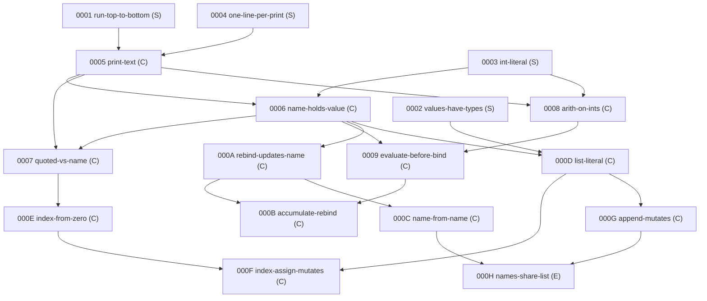

# A tagged concept-DAG knowledge base for Python prediction exercises

> Design document. Standalone: it assumes only the delivery-platform
> interface described in §1 and depends on no particular codebase,
> framework, or storage system. The knowledge base (KB) it specifies is
> data plus pure functions.

## 1. Vision recap

Students meeting Python for the first time (upper primary through early
secondary) learn by **predicting what tiny programs print**. The
delivery platform can execute any small Python program and capture its
exact output — so the interpreter is the only answer key. Exercises are
seeded, deterministic program generators; the platform persists small
per-student records and can show a short rule card after a miss.

This design replaces a flat catalogue of exercise topics with:

- **A concept graph.** Nodes are atomic concepts; edges are
  prerequisites; the graph is a DAG rooted in a small set of true
  fundamentals, so every concept has a traceable lineage to the roots.
  Every node carries a stable opaque tag (Stacks-Project-style:
  short, permanent, never reused) plus a renamable human slug.
- **Exercises bound to the graph.** Every exercise declares one focus
  concept and a set of assumed concepts; a student who has met the
  ancestors meets **at most one new thing** per exercise.
- **Verified footprints.** The set of concepts a generated program
  actually uses is *computed from the code*, never author-declared, and
  checked against the exercise's declared closure on every generated
  program. Lineage on the honor system rots; lineage checked by machine
  is the product.
- **A knowledge base that is data**, consumable through one narrow
  interface, from which the human-readable curriculum reference is
  *generated* — with every sample output obtained by real execution.

The eight pedagogical ground rules (one question at a time; the
interpreter as sole answer key; predict-then-verify with exact-output
grading; no spoilers; one question, one rule; errors are information;
the student-facing style contract; generator hygiene) are inherited
unchanged. §12 maps each rule to its structural home in this design so
none is dropped silently.

---

## 2. Concept model

### 2.1 What is one concept? — the granularity rubric

The unit of decision is a **predictable fact about program behavior**.
A candidate concept is admitted, split, or merged by four ordered
tests plus a guard:

**T1 — Independent-failure test (forces a split).** Can you write two
minimal programs such that a student who knows all the ancestors can
plausibly get one right and the other wrong *for a reasoned cause*, not
a slip? If yes, the candidate contains two independently failable facts
and must split. "Knows `s[1]`, fails `s[-1]`" is a real, reasoned state
→ negative indexing splits off. "Knows `2+3`, fails `2*3`" is an
arithmetic slip, not a model defect → no split.

**T2 — Co-occurrence test (forces a merge; overrides T1).** If every
minimal witness program for fact A unavoidably also exercises fact B in
the same syntactic form, and vice versa, they are one node; the weaker
fact becomes a variant axis, not a node. This clause exists because T1
alone over-splits: "the slice start is included" and "the slice stop is
excluded" are separately failable in principle, but no program
`s[a:b]` exercises one endpoint without the other — so `slice-half-open`
is one node. (Open-ended slices `s[a:]` *can* be witnessed separately,
so they are permitted to be a distinct node.)

**T3 — One-sentence-rule test (sanity check).** The node must be
stateable as one beginner-facing sentence, and that sentence plus the
ancestors' sentences must fully determine the correct answer to every
exercise focused on it. If two sentences with independently checkable
content are needed, return to T1.

**T4 — Distinct-wrong-answer test (tie-breaker).** Each node should own
a **characteristic wrong answer** — the output a student produces when
they lack exactly this node. Two candidates sharing one wrong answer
for one misconception merge; one candidate producing two systematically
different wrong answers traceable to two misconceptions splits.

**Budget guard.** A node must support at least two materially different
exercise programs (different shape, not just different literals). A
fact only showable as its parent's exercise with one token changed is a
*variant axis* of the parent, recorded in the parent's rule card.

### 2.2 Rubric dry run — ten benchmark exercises

The rubric was calibrated by hand-classifying ten familiar beginner
exercises. The calibration genuinely changed the design twice: the
slice case forced T2 into the rubric, and the cold-start walkthrough
(§2.8) forced the merge of "print writes text" with "quotes delimit
text" into the single root `print-text`.

| Exercise | Focus node | Rubric notes |
|---|---|---|
| `print(10/4)` | `div-yields-float` | T1 splits it from `arith-on-ints`: students solid on `+ - *` answer `2` for reasoned causes. Wrong answer: `2`. |
| `print(s[1:3])` | `slice-half-open` | T1 wanted two endpoint nodes; T2 merged them — no witness isolates one endpoint. |
| `b = a; b.append(3); print(a)` | `names-share-list` | Compound footprint, single new fact. Wrong answer: the unmutated list. |
| `if []:` | `truthiness-empty-falsy` | Separate from `if-runs-or-skips` (T1: students who handle `if x > 3` fail this) and from `bool-is-int` (T4: different misconception). |
| elif chain | `elif-first-true-wins` | One node despite containing "tests run top-down" and "only the first true branch runs" — T2: any elif witness exercises both. |
| `range(2, 7)` | `range-start-stop` | Separate from `range-stop-excluded`: knowing `range(5)` is 0…4 does not prevent answering "seven numbers starting at 2". |
| `b += [2]` on a shared list | `plus-eq-mutates-list` | Its entire content is the contrast between `b = b + [2]` (rebind; `a` unaffected) and `b += [2]` (mutation; `a` affected). |
| `print(str(3) + "4")` | `str-of-int` | The conversion is the focus; concatenation is assumed. Wrong answer: `7`. |
| `a, b = b, a` | `swap-right-side-first` | One node — T2: "the right side is fully evaluated before any name rebinds" has no witness except a swap-shaped program. |
| `"k" in d` | `in-dict-checks-keys` | Separate from `dict-lookup-by-key` (T4: the keys-not-values misconception is untouched by lookup exercises). |

Ten exercises → ten distinct focus nodes, none vacuous, none needing a
sub-split. The result feels neither atomized nor lumped: the slice
stayed whole, aliasing stayed one atom on a rich ancestor set, and
truthiness did not get lumped into `if`.

### 2.3 Worked splitting calls

- **Split — negative indexing is its own node.** `index-from-end`
  (edge) is a child of `index-from-zero` (core). T1: "solid on `s[1]`,
  fails `s[-1]`" is common. T4: its wrong answers (expecting an error;
  off-by-one because the `-0` intuition breaks) are its own.
- **Split — `%` sign behavior is separate from `%` remainder.**
  `mod-remainder` (core, positive operands) and `mod-sign-of-divisor`
  (edge, child). T1 is decisive: a student with a correct
  positive-operand model answers `-7 % 3` as `-1`; the actual `2` is a
  fact they could not derive.
- **Split — `while` is not a variant of `for`.** Separate nodes, no
  edge between them. T4: disjoint failure modes — one-too-many /
  one-too-few iterations from condition timing, vs element-visiting
  errors.
- **Split — dict membership vs dict lookup.** `in-dict-checks-keys` is
  a child of `dict-lookup-by-key` — knowing `d["k"]` gives no
  protection against thinking `"v" in d` finds values.
- **Over-split to avoid — operator-per-node arithmetic.** `+ - *` on
  ints is one node, `arith-on-ints`; missing one while knowing the
  others is a slip (T1 fails). Precedence *is* its own node
  (`op-precedence`): "is `2+3*4` 20 or 14?" is a reasoned failure.
- **Over-split to avoid — "append adds at the end" vs "append mutates
  in place."** Both facts live in `append-mutates` (T2): any witness of
  either exercises both, and in-place-ness only becomes *separately*
  observable through a second name — which is precisely the child node
  `names-share-list`, not a sibling fact of append.
- **Fold — `+=` on numbers is not a node.** `x += 1` has no witness
  distinguishable from `x = x + 1` (T2); the spelling is a variant axis
  of `accumulate-rebind`. On *shared lists* the spelling changes the
  output — that is the separate node `plus-eq-mutates-list`.

### 2.4 Concept-count budget

**68 nodes for the scope of this document; hard cap 75.**

| Topic | Nodes | Core / Edge / Structural |
|---|---|---|
| Structural roots | 4 | 0 / 0 / 4 |
| State & I/O | 10 | 9 / 1 / 0 |
| Numbers & bools | 10 | 7 / 3 / 0 |
| Strings | 8 | 5 / 3 / 0 |
| Lists & aliasing | 10 | 6 / 4 / 0 |
| Conditions & logic | 9 | 6 / 3 / 0 |
| Loops & ranges | 10 | 9 / 1 / 0 |
| Dicts & tuples | 7 | 5 / 2 / 0 |
| **Total** | **68** | **47 / 17 / 4** |

Justification: at ~68 nodes the student's **frontier** (unmet concepts
whose prerequisites are all met) stays about 3–8 nodes wide throughout
— wide enough for varied sessions, narrow enough that "what should I
meet next?" has a real answer. At 150+ micro-nodes the frontier
degenerates into a queue of near-identical single-fact tickets and the
DAG stops informing selection. The 7-node headroom below the cap
absorbs in-scope discoveries; the tag space itself is effectively
unlimited, so the known next expansion (functions: def/call,
parameters, return-vs-print, local scope, … ≈ 12 nodes) attaches
without touching existing structure.

### 2.5 Tags and slugs

Every concept gets a **permanent opaque tag** and a **mutable human
slug**.

- **Tag format:** 4 characters of Crockford base-32 (digits and
  uppercase letters minus `I L O U`), e.g. `0D2F`. Over a million
  tags; unambiguous when handwritten by a child or a teacher; and
  deliberately meaning-free, so renames and reorganizations never
  invalidate a reference printed on a rule card or stored in a student
  record.
- **Slug format:** kebab-case, unique at any moment, freely renamable
  (`div-yields-float`, `names-share-list`). Slugs are for humans;
  tags are for records.
- **Allocation:** a single **append-only tag ledger** file is the
  source of truth. Minting a concept appends one entry
  `{tag, slug, statement, kind, parents, status: "active"}` using the
  next unused tag in ledger order. Tag order is allocation history and
  carries no other meaning.
- **Permanence:** a tag, once allocated, exists forever — never
  deleted, never reused, never re-pointed at an unrelated concept.
- **Split protocol** (the Stacks Project answer, adopted): when concept
  `T` splits, mint two *new* tags `T₁`, `T₂`; set `T.status = "split"`
  with `successors: [T₁, T₂]`. `T` becomes a permanent redirect. The
  same ledger change must declare the **mastery-migration rule** for
  student records held under `T` (default: credit both successors as
  met — the student answered exercises spanning both facts). Every
  exercise referencing `T` must be re-pointed to exactly one successor
  before the structural checks pass.
- **Merge protocol:** the elder tag survives and absorbs; the younger
  gets `status: "merged-into"` with a single successor and redirects
  forever. Slug history is kept per tag.

### 2.6 Structural roots

Four concepts are **structural** (`kind: structural`): never a focus,
no exercises, auto-granted as met from the first session.

| Slug | Statement |
|---|---|
| `run-top-to-bottom` | Statements execute once, in order, each finishing before the next. |
| `values-have-types` | Every value is one specific kind of thing — a number, some text, a list… |
| `int-literal` | Bare digits in code mean a whole-number value. |
| `one-line-per-print` | Each `print` produces exactly one line of output. |

The operational test for structural status: a node is structural iff it
has **no discriminating witness** — no minimal program whose output
differs between a student who holds the concept and one who doesn't.
`print("hi")` discriminates (quotes or no quotes in the answer), so
printing is exercisable; nothing in a straight-line one-print program
discriminates "programs run top to bottom", so it is structural.
(`one-line-per-print` is the exercise-format contract itself, stated as
a concept so the format has a place in the graph.)

### 2.7 The anti-sterility rule

Early exercises may use only root concepts, which risks vacuity — ten
near-copies of `x = 4` / `print(x)` teach nothing after the first. Two
guards:

1. **Every exercisable node declares at least one characteristic wrong
   answer** — a plausible output derived from a named misconception —
   and its intro exercise must make that wrong answer available.
   `print("hi")` is non-vacuous under exact-output grading because
   `"hi"` (with quotes) is a live wrong answer; `x = 4; print(x)`
   because `x` is.
2. **Braiding.** Once an ancestor is met, its material may appear in
   later exercises' *assumed* sets: after `arith-on-ints` is met,
   `name-holds-value` reviews may bind computed values (`x = 2 + 3`).
   Ten questions at a two-node frontier are then ten genuinely
   different predictions, not ten clones.

### 2.8 The one-new-thing contract

**"Introduce."** Exercise E introduces concept C iff (a) `focus(E) = C`;
(b) the static contract below holds; and (c) E is **discriminating**:
the output predicted by a student model holding all of `assumed(E)` but
lacking C differs from the actual output. Condition (c) is
load-bearing — it guarantees E *teaches* C rather than merely
containing C's syntax, and it defines E's characteristic wrong answer
for free.

**"Met."** A student has met C when they have given **at least one
correct prediction on an exercise whose focus is C**. Not first
exposure — a shown answer or a lucky skip would unlock children built
on sand, and those children's discrimination guarantee silently breaks
when an "assumed" concept isn't actually held. Not a mastery streak —
that throttles the frontier to a crawl and duplicates the scheduling
machinery (§6), which remains a separate dial. One exact-output
correct prediction is meaningful evidence: near-misses do not pass.

**Static contract** — for every exercise E and every program P it can
generate:

```
footprint(P) ⊆ assumed(E) ∪ {focus(E)} ∪ Structural
assumed(E)  ⊆ ancestors(focus(E))          (transitive)
focus(E)    ∉ assumed(E)
```

Structural concepts get special treatment: they are vacuously met, so
they are **always permitted in a footprint and never listed in
`assumed`**. (They cannot simply ride along in `assumed`, because a
structural root need not be an ancestor of every focus —
`values-have-types` is no ancestor of `div-yields-float` — and the
ancestor condition must stay exact.)

The footprint is computed by the analyzer (§4); the contract is checked
mechanically for every exercise across sampled generations (§9), so an
exercise can never silently smuggle an untaught concept.

**Review exercises** are the same object with `role: "review"` instead
of `"intro"`. The contract is identical — focus stays out of `assumed`
because listing it there would be redundant, not because review is
special. Only the dynamic gate differs: a review of C is offerable once
C itself is met.

**Contrast exercises** (the spot-the-difference form, §5) declare
`contrast: <tag>`. The contrasted concept must be an ancestor of the
focus **and** a member of `assumed` — so a contrast exercise still
meets exactly one new thing, and the flag exists so the rule card can
render the pair side by side. Two-unmet-concepts contrast is a contract
violation by construction.

**Dynamic contract.** Selection may offer E iff every concept in
`assumed(E)` is met (structural concepts are vacuously met). The
offerable set is therefore: intros whose focus is on the frontier, plus
reviews of met nodes.

**Cold start, walked through.** A brand-new student's met set is
exactly the four structural grants. The frontier is then
{`print-text`} — the sole node all of whose parents are structural. Its
intro exercise:

```python
print("hi")
```

Footprint: {`run-top-to-bottom`, `one-line-per-print`, `print-text`} —
the contract holds with an *empty* `assumed` set (structural tags are
always permitted). This works
*because* `print-text` absorbs "quotes delimit text": an earlier draft
kept `str-literal-quotes` as a separate node, and the walkthrough
exposed the cycle — printing has no witness without a literal, and the
quote rule has no witness without printing, so by T2 they are one root
node whose characteristic wrong answer is `"hi"` with the quotes.
First correct attempt → `print-text` met → the frontier grows to
{`name-holds-value`, `arith-on-ints`}. The system boots from zero. ∎

---

## 3. The concept inventory — all 68 nodes

This table is the first draft of the tag ledger itself. Tags are in
allocation order, which is *authoring history, not topology* — a tag
carries no meaning, and several tags sit outside their topic's block
because they were minted while working out the roots-to-aliasing slice
(§10.1). Parents are given by slug for readability; the ledger stores
them by tag. Kind: **S** structural, **C** core, **E** edge. The
"wrong answer" column is each node's characteristic wrong answer — the
output produced by the named misconception (§2.7); structural nodes
have none because they have no witness.

### 3.1 Structural roots (4)

| Tag | Slug | Kind | Parents | Statement |
|---|---|---|---|---|
| `0001` | `run-top-to-bottom` | S | — | Statements execute once, in order, each finishing before the next. |
| `0002` | `values-have-types` | S | — | Every value is one specific kind of thing — a number, some text, a list… |
| `0003` | `int-literal` | S | — | Bare digits in code mean a whole-number value. |
| `0004` | `one-line-per-print` | S | — | Each `print` produces exactly one line of output. |

### 3.2 State & I/O (10 — 9 core, 1 edge)

| Tag | Slug | Kind | Parents | Statement | Wrong answer |
|---|---|---|---|---|---|
| `0005` | `print-text` | C | run-top-to-bottom, one-line-per-print | `print("…")` writes the quoted characters, without the quotes, as one line. | `"hi"` with the quotes |
| `0006` | `name-holds-value` | C | print-text, int-literal | `x = v` makes the name x hold the value v; `print(x)` shows that value. | the letter `x` |
| `0007` | `quoted-vs-name` | C | print-text, name-holds-value | `"x"` is the text x; bare `x` looks up the name x. | the value where the text was meant, or vice versa |
| `0009` | `evaluate-before-bind` | C | name-holds-value, arith-on-ints | The right side is computed down to one value before the name stores it. | `2 + 3` unevaluated |
| `000A` | `rebind-updates-name` | C | name-holds-value | A second `x = …` replaces x's value; the old value is gone. | the first value |
| `000B` | `accumulate-rebind` | C | evaluate-before-bind, rebind-updates-name | `x = x + 1` reads the old value, computes, then rebinds x to the result. | the old value, or one step short |
| `000C` | `name-from-name` | C | rebind-updates-name | `b = a` gives b the value a holds *now*; rebinding a later does not change b. | a's new value |
| `000J` | `print-multi-args` | C | print-text, name-holds-value | `print(a, b)` writes both values on one line with a single space between them. | missing space, or a printed comma |
| `000K` | `str-literal-vs-number` | C | quoted-vs-name, values-have-types | `"3"` is text and `3` is a number; they can print alike but are different kinds of value. | treats `"3"` as the number 3 |
| `000M` | `swap-right-side-first` | E | name-from-name, evaluate-before-bind | In `a, b = b, a` the whole right side is evaluated before either name rebinds — so the values swap. | both names end up with the same value |

### 3.3 Numbers & bools (10 — 7 core, 3 edge)

| Tag | Slug | Kind | Parents | Statement | Wrong answer |
|---|---|---|---|---|---|
| `0008` | `arith-on-ints` | C | int-literal, print-text | `+ - *` on whole numbers compute the usual math result. | (slips only — the intro checks fluency) |
| `000N` | `op-precedence` | C | arith-on-ints | `*` and `/` bind tighter than `+` and `-`; parentheses override. | `20` for `2 + 3 * 4` |
| `000P` | `div-yields-float` | C | arith-on-ints | `/` always gives a float — even when it divides evenly. | `5` for `10 / 2` |
| `000Q` | `floordiv-quotient` | C | arith-on-ints | `//` is whole-number division: how many whole times the divisor fits. | a decimal answer |
| `000R` | `mod-remainder` | C | floordiv-quotient | `%` gives the remainder left over after whole-number division. | the quotient |
| `000S` | `mod-sign-of-divisor` | E | mod-remainder | `%` takes the sign of the divisor, so `-7 % 3` is `2`. | `-1` |
| `000T` | `str-of-int` | C | str-literal-vs-number | `str(3)` makes the text `"3"` out of the number 3. | `7` for `str(3) + "4"` |
| `000V` | `int-of-str` | C | str-literal-vs-number, arith-on-ints | `int("25")` makes the number 25 out of digit text. | `"251"` for `int("25") + 1` |
| `000W` | `float-inexact` | E | div-yields-float | Floats are approximations; some results print with a long tail of digits. | `0.3` for `0.1 + 0.2` |
| `000X` | `bool-is-int` | E | bool-values, arith-on-ints | `True` counts as 1 and `False` as 0 in arithmetic. | an error, or `TrueTrue` |

### 3.4 Strings (8 — 5 core, 3 edge)

| Tag | Slug | Kind | Parents | Statement | Wrong answer |
|---|---|---|---|---|---|
| `000Y` | `str-concat` | C | quoted-vs-name | `+` on two texts glues them together with nothing in between. | an inserted space, or number addition |
| `000Z` | `str-repeat` | C | str-concat, arith-on-ints | text `*` number repeats the text that many times. | multiplication of something |
| `000E` | `index-from-zero` | C | quoted-vs-name | `s[i]` fetches one character by position, counting from 0. | the character at position i counting from 1 |
| `0010` | `index-from-end` | E | index-from-zero | Negative positions count from the end: `s[-1]` is the last character. | an error, or off-by-one from the end |
| `0011` | `slice-half-open` | C | index-from-zero | `s[a:b]` is the characters from position a up to but not including b. | includes the character at b |
| `0012` | `slice-open-ended` | C | slice-half-open | A missing endpoint means "from the start" or "to the end": `s[a:]`, `s[:b]`. | stops one short, or an error |
| `0013` | `str-immutable-rebind` | E | name-from-name, str-concat | Text never changes in place; operations build new text, and rebinding a name leaves old copies elsewhere untouched. | the copy shows the change |
| `0014` | `str-compare-code-points` | E | compare-ops, quoted-vs-name | Text comparison goes character by character by code point — all capitals come before all lowercase. | `False` for `"Zoo" < "apple"` |

### 3.5 Lists & aliasing (10 — 6 core, 4 edge)

| Tag | Slug | Kind | Parents | Statement | Wrong answer |
|---|---|---|---|---|---|
| `000D` | `list-literal` | C | values-have-types, name-holds-value | `[a, b, c]` builds a list; it prints with brackets, commas, and spaces. | `1 2` or `[1,2]` — display details wrong |
| `001Z` | `aggregate-builtins` | C | list-literal | `len`, `sum`, `max`, `min` compute one value from a whole list. | off-by-one length |
| `000F` | `index-assign-mutates` | C | index-from-zero, list-literal | `xs[i] = v` changes that one slot of the existing list. | the old list, or a fresh one-element list |
| `000G` | `append-mutates` | C | list-literal | `xs.append(v)` changes the existing list, adding v at the end. | the list without v |
| `0020` | `extend-vs-append` | E | append-mutates | `append([4, 5])` adds one item (a nested list); `extend([4, 5])` adds each item. | flattened where nested, or vice versa |
| `0021` | `list-concat-new` | C | list-literal | `+` on two lists builds a brand-new list; neither original changes. | thinks an original changed |
| `0022` | `nested-lists` | C | list-literal, index-from-zero | A list can hold lists; `g[r][c]` picks row r, then position c inside it. | row and column swapped |
| `000H` | `names-share-list` | E | name-from-name, append-mutates | `b = a` does not copy a list — one list, two names, so a change through either shows through both. | the unmutated list |
| `0023` | `plus-eq-mutates-list` | E | names-share-list, list-concat-new | On a list, `b += […]` changes the shared list in place; `b = b + […]` builds a new list just for b. | the unmutated list for `+=`, or the mutated one for `+` |
| `0024` | `slice-copies` | E | slice-half-open, names-share-list | `a[:]` builds a real copy — mutating the copy leaves the original alone. | the original shows the change |

### 3.6 Conditions & logic (9 — 6 core, 3 edge)

| Tag | Slug | Kind | Parents | Statement | Wrong answer |
|---|---|---|---|---|---|
| `0015` | `compare-ops` | C | arith-on-ints | `< > <= >= == !=` compare two values and yield a yes-or-no result. | comparison read backwards |
| `0016` | `bool-values` | C | compare-ops | The yes-or-no values are `True` and `False`, and they print exactly like that. | `true`, `yes`, or `1` |
| `0017` | `if-runs-or-skips` | C | bool-values | `if` runs its indented lines when the test is `True` and skips them when it is `False`. | the skipped branch's output |
| `0018` | `else-otherwise` | C | if-runs-or-skips | `else` runs exactly when the `if` test was `False` — one branch runs, never both. | both branches' output |
| `0019` | `elif-first-true-wins` | C | else-otherwise | In an `if/elif/…` chain, tests run top to bottom and only the first true branch runs. | a later true branch also runs |
| `001A` | `bool-ops` | C | bool-values | `and` needs both sides true; `or` needs at least one; `not` flips. | `or` treated as exclusive |
| `001B` | `truthiness-empty-falsy` | E | if-runs-or-skips, list-literal | A test can be any value: `0`, `""`, and `[]` count as false; everything else as true. | expects an error, or nonempty-is-false |
| `001C` | `and-or-return-operand` | E | bool-ops, truthiness-empty-falsy | `and`/`or` return one of their operands, not necessarily `True`/`False`. | `True` instead of the operand |
| `001D` | `chained-compare` | E | compare-ops, bool-ops | `a < b < c` means `a < b and b < c` — not a comparison of a result with c. | grouped-left evaluation |

### 3.7 Loops & ranges (10 — 9 core, 1 edge)

| Tag | Slug | Kind | Parents | Statement | Wrong answer |
|---|---|---|---|---|---|
| `001E` | `loop-for-visits-each` | C | list-literal | `for x in xs:` runs the body once per item, with x holding each item in turn. | one run total, or the wrong count |
| `001F` | `range-stop-excluded` | C | loop-for-visits-each | `range(n)` counts `0, 1, …, n-1` — n itself is not included. | includes n |
| `001G` | `range-start-stop` | C | range-stop-excluded | `range(a, b)` counts from a up to but not including b. | includes b, or counts b−a+1 numbers |
| `001H` | `range-step` | C | range-start-stop | `range(a, b, s)` counts from a in steps of s, stopping before b. | includes the endpoint, or wrong stride |
| `001J` | `loop-accumulate` | C | loop-for-visits-each, accumulate-rebind | A running total updates once per loop pass; its final value exists after the loop. | off-by-one total |
| `001K` | `loop-build-list` | C | loop-for-visits-each, append-mutates | Appending once per pass grows a list one item per pass. | wrong length or order |
| `001M` | `while-repeats-while-true` | C | compare-ops, accumulate-rebind | `while` re-tests before every pass and stops the moment the test is `False`. | one pass too many or too few |
| `001N` | `break-exits` | C | loop-for-visits-each, if-runs-or-skips | `break` leaves the whole loop immediately. | the loop finishes anyway |
| `001P` | `continue-skips` | C | loop-for-visits-each, if-runs-or-skips | `continue` skips the rest of this pass and goes on to the next one. | the loop exits |
| `001Q` | `for-else-no-break` | E | break-exits | A loop's `else` runs only when the loop finished without `break`. | `else` tied to the `if`, or always runs |

### 3.8 Dicts & tuples (7 — 5 core, 2 edge)

| Tag | Slug | Kind | Parents | Statement | Wrong answer |
|---|---|---|---|---|---|
| `001R` | `dict-lookup-by-key` | C | quoted-vs-name, index-from-zero | `d = {"a": 1}` maps keys to values; `d["a"]` fetches the value stored under that key. | the key itself, or a positional index |
| `001S` | `dict-key-assign` | C | dict-lookup-by-key | `d[k] = v` stores v under k — adding the key if new, replacing if it exists. | old value survives, or new key rejected |
| `001T` | `dict-get-default` | C | dict-lookup-by-key | `d.get(k, alt)` fetches like `d[k]` but yields alt when the key is missing. | alt even when the key exists |
| `001V` | `in-dict-checks-keys` | E | dict-lookup-by-key, bool-values | `k in d` asks about keys only — values are invisible to `in`. | `True` for a value |
| `001W` | `tuple-pack-print` | C | name-holds-value, values-have-types | `(a, b)` groups values into one fixed bundle; it prints with parentheses and commas. | no parentheses |
| `001X` | `tuple-unpack` | C | tuple-pack-print | `x, y = pair` spreads a two-item bundle into two names, in order. | both names get the whole tuple |
| `001Y` | `tuple-by-comma` | E | tuple-pack-print | The comma makes the tuple, not the parentheses: `x = 3,` is a one-item tuple. | `3` |

---

## 4. The footprint analyzer

### 4.1 Architecture

**Decision: hybrid, with a purpose-built static analyzer as the
normative definition and the real Python interpreter as a
cross-validation oracle in the test suite.** The generated programs are
a tiny, closed Python subset — at most ~10 lines, straight-line or a
single loop, no functions, classes, imports, or comprehensions — so a
purpose-built recursive-descent parser plus a micro abstract
interpreter is a few hundred lines and *exact within the subset*; a
regex layer cannot express the set-inclusion contract (one missed
observation silently voids the one-new-thing promise), and delegating
the normative definition to a live interpreter would tie the KB to a
delivery runtime. The analyzer is a pure function
`footprint(source) → {tags, evidence, warnings} | error` with no I/O,
implementable in any host language.

| Layer | What it is | Authoring lint | Runtime | Test suite |
|---|---|---|---|---|
| micro-parser | recursive-descent parser for the subset grammar → small AST | yes | optional (dev flag) | yes — every sampled program |
| footprint pass | AST walk + micro abstract interpreter → tag set + evidence | yes | optional (dev flag) | yes — every sampled program |
| interpreter oracle | real `ast.parse` structural diff + end-state type probe + real execution | no | no (execution is the product, not a check) | yes — stratified subsample |

**The subset grammar is closed; violations are hard errors.**
Statements: assignment (single target: name, subscript, or
tuple-of-names), augmented assignment, expression statement (only a
`print(...)` call or a whitelisted method call), `if/elif/else`, `for`,
`while`, `break`, `continue`. Expressions: literals (int, float, str,
bool, list, dict, tuple), names, binary operators
(`+ - * / // % **`), unary `-` and `not`, comparisons (including
chains, `in`, `is`), boolean operators, subscripts (index and slice),
calls to whitelisted builtins (`print len sum max min range str int
list`) and whitelisted methods (`append pop insert remove extend
get upper lower`). Everything else — comprehensions, f-strings,
`lambda`, keyword arguments, sets — is **unparseable ⇒ unfootprintable
⇒ analyzer failure**. This doubles as a hygiene guard: the generator
vocabulary literally cannot outgrow the concept vocabulary silently.

**Totality rule.** The syntax→concept mapping must be *total* over the
subset: every AST observation either maps to at least one concept tag
or raises `unmapped-syntax`. A construct the concept graph has no node
for therefore *blocks authoring* until the graph owner either adds a
node or the generator drops the construct — vocabulary gaps surface;
they never leak.

### 4.2 The micro abstract interpreter

**Decision: build it (~250 lines, dependency-free).** It is the only
honest way to compute the type- and identity-dependent tags, and the
subset makes it trivial.

- **Abstract value:** `{type: int|float|str|bool|list|dict|tuple|range|none|⊤, objId?}`.
  An `objId` is allocated at each mutable-constructor site (list/dict
  literal, full slice `a[:]`, `list(…)`, list `+`); `b = a` **copies
  the objId** — that *is* aliasing. Slices and `+` allocate fresh ids.
- **Store:** name → abstract value, plus per-objId bookkeeping:
  `{names: Set, mutated: bool, mutatedWhileShared: bool}`.
- **Branches:** `if/elif/else` arms are analyzed from the same entry
  store; emitted tags union; stores merge. A name whose type differs
  across arms becomes `⊤`, and any type-directed rule that later
  touches `⊤` raises `untypeable-name` — generators must keep types
  branch-stable (tiny prediction programs always should).
- **Loops:** the body is abstractly executed once against the entry
  store, then re-checked for a type-and-objId fixpoint; a type-changing
  loop is a hard error. `break`/`continue` need no flow modeling for
  typing.
- **Expression typing:** literal types; a binary-operator table
  (`int∘int→int` for `+ - * ** // %`; anything`/`anything→float;
  `str+str→str`; `str*int→str`; `list+list→list` fresh objId;
  comparisons→bool; `and/or`→union of operand types); a call table
  (`len→int`, `sum→int|float`, `max/min→`element type, `range→range`,
  `list(range)→list`, `str(…)→str`, `int(…)→int`, `.get→`value type,
  `.upper/.lower→str`, list mutators→none except `pop→`element type,
  `print→none`).

The analyzer emits the **footprint** (tag set) and an **evidence list**
(`tag ← rule id @ line`); evidence is what makes error messages and
waivers precise, and what the explanation-coverage check (§9) consumes.

### 4.3 Syntax→concept mapping

Rows marked **[S]** depend on the abstract store and are restated
precisely in §4.4. Tags are written as slugs for readability.

| # | Observation | Tag(s) emitted |
|---|---|---|
| 1 | integer literal | `int-literal` |
| 2 | string literal | `quoted-vs-name` when any name is also read in the program; else folded into `print-text` |
| 3 | `True`/`False` literal, or any expression of static type bool reaching `print` or an assignment | `bool-values` **[S]** |
| 4 | name in load position | `name-holds-value` |
| 5 | assignment to an already-bound name | `rebind-updates-name` **[S]** |
| 6 | assignment whose right side reads the target name | `accumulate-rebind` **[S]** |
| 7 | assignment whose value is a compound expression (operator or call) — a bare name or literal does not qualify | `evaluate-before-bind` |
| 8 | `b = a` where a's static type is immutable | `name-from-name` **[S]** |
| 9 | `b = a` where a's static type is list or dict | alias edge; `names-share-list` on observation **[S]** |
| 10 | `print` with one argument | `print-text` |
| 11 | `print` with 2+ arguments | `print-multi-args` (+ `print-text`) |
| 12 | `+ - * **` with numeric operands | `arith-on-ints` **[S]** |
| 13 | mixed-precedence operator expression without full parenthesization | `op-precedence` |
| 14 | `/` | `div-yields-float` |
| 15 | `//` | `floordiv-quotient` |
| 16 | `%` | `mod-remainder`; operand signs differ → also `mod-sign-of-divisor` **[S]** |
| 17 | `str(x)` with numeric x | `str-of-int` **[S]**; `int(x)`/`float(x)` with str x → `int-of-str` **[S]** |
| 18 | float literal or `/` whose printed result is non-terminating-short | `float-inexact` only via the focus declaration — see §4.5 salience note |
| 19 | `True`/`False` as operand of arithmetic | `bool-is-int` **[S]** |
| 20 | `+` with a str operand | `str-concat` **[S]** |
| 21 | `*` with str × int | `str-repeat` **[S]** |
| 22 | subscript load with non-negative index | `index-from-zero` **[S]** (dispatches on container type: str/list) |
| 23 | subscript load with negative index literal | `index-from-end` (+ row 22's container dispatch) **[S]** |
| 24 | subscript with a two-endpoint slice | `slice-half-open` |
| 25 | slice with a missing endpoint | `slice-open-ended` (+ `slice-half-open`) |
| 26 | copy-then-rebind-then-read pattern on str | `str-immutable-rebind` **[S]** |
| 27 | str/str comparison with `< > <= >=` | `str-compare-code-points` **[S]** |
| 28 | list literal | `list-literal` |
| 29 | `len/sum/max/min` call | `aggregate-builtins` |
| 30 | assignment to a subscript | `index-assign-mutates` **[S]** |
| 31 | `.append` on a list | `append-mutates` **[S]**; `.extend`, or `.append` of a list literal | `extend-vs-append` **[S]** |
| 32 | `+` with list operands | `list-concat-new` **[S]** |
| 33 | double subscript `g[r][c]` or list-of-lists literal | `nested-lists` **[S]** |
| 34 | `+=` on a name of list type with a shared objId | `plus-eq-mutates-list` **[S]** |
| 35 | full slice `a[:]`, `list(a)` on a list | `slice-copies` **[S]** |
| 36 | comparison operators on numbers | `compare-ops` |
| 37 | `if` without `elif` | `if-runs-or-skips`; with `else` → also `else-otherwise`; with `elif` → also `elif-first-true-wins` |
| 38 | `and/or/not` over bool-typed operands | `bool-ops` **[S]** |
| 39 | `if`/`while` test, or boolean operand, of non-bool static type | `truthiness-empty-falsy` **[S]** |
| 40 | `and/or` of non-bool static result type in a value position | `and-or-return-operand` **[S]** |
| 41 | chained comparison (3+ operands) | `chained-compare` |
| 42 | `for` | `loop-for-visits-each` |
| 43 | `range` with 1 arg | `range-stop-excluded`; 2 args → also `range-start-stop`; 3 args → also `range-step` |
| 44 | accumulate-rebind inside a loop body | `loop-accumulate` **[S]** |
| 45 | `.append` inside a loop body | `loop-build-list` **[S]** |
| 46 | `while` | `while-repeats-while-true` |
| 47 | `break` | `break-exits`; `continue` → `continue-skips` |
| 48 | `else` attached to a loop | `for-else-no-break` |
| 49 | dict literal, or subscript load on dict type | `dict-lookup-by-key` **[S]** |
| 50 | assignment to a dict subscript | `dict-key-assign` **[S]** |
| 51 | `.get` call | `dict-get-default` |
| 52 | `in`/`not in` with dict-typed right side | `in-dict-checks-keys` **[S]** |
| 53 | tuple literal, or tuple display in print | `tuple-pack-print` |
| 54 | tuple-target assignment not reading its targets | `tuple-unpack` |
| 55 | tuple-target assignment reading at least one target | `swap-right-side-first` (only — see §4.4 rule 12) |
| 56 | one-item tuple by trailing comma | `tuple-by-comma` |
| 57 | anything else | hard error `unmapped-syntax` |

### 4.4 Semantic rules — every concept invisible to bare syntax

All rules read the micro-interpreter's store at the program point of
the observation.

1. **`name-from-name` vs `names-share-list` — the crux.** For
   `b = a`: if a's static type is immutable ⇒ `name-from-name`; if
   list/dict ⇒ b receives a's objId (an alias edge, no tag yet).
   **Observability rule:** `names-share-list` enters the footprint iff,
   after two or more names share an objId, either (a) the object is
   mutated and a *different* alias is subsequently read or printed, or
   (b) two aliases are compared with `is`. A latent, never-observed
   alias emits the warning `latent-alias` instead — authors should not
   build accidentally-aliasing programs, but an unobserved alias does
   not charge the student a concept the output cannot show.
2. **`rebind-updates-name`** — assignment to a name already present in
   the store (binding history is semantic state).
3. **`accumulate-rebind`** — assignment (or numeric `+=`, its variant
   spelling) whose right side reads the target name.
4. **Operator disambiguation by operand type** — `+`/`*` dispatch on
   the abstract operand types to `arith-on-ints`, `str-concat`,
   `str-repeat`, or `list-concat-new`; a str+int mix would raise in
   Python and is therefore the hard error `would-raise`.
5. **Subscript dispatch** — `s[i]` dispatches on the container's
   abstract type: str/list → `index-from-zero` (plus `index-from-end`
   for a negative literal index); dict → `dict-lookup-by-key`;
   `g[r][c]` (subscript of a subscript) → `nested-lists`.
6. **`str-immutable-rebind`** — three legs, all required: some name t
   is assigned from str-typed s; s is later rebound by an expression
   reading s's old value; t is then read or printed. Copy plus rebind
   without reading t is just `name-from-name` + `rebind-updates-name`.
7. **`slice-copies`** — a fresh objId from `a[:]`/`list(a)` on a list,
   charged when the copy or the original is subsequently mutated and
   the other is later read (the divergence is the concept); an
   unmutated copy emits the warning `pointless-copy`.
8. **`plus-eq-mutates-list`** — `+=` whose target is list-typed and
   whose objId has ≥2 names at that point. The contrast case
   `b = b + […]` allocates a fresh objId and rebinds ⇒ emits
   `list-concat-new` + `rebind-updates-name` (and `names-share-list`
   if the old alias is then observed) — exactly the distinction the
   exercises teach.
9. **`index-assign-mutates` / `append-mutates` / `extend-vs-append` /
   `dict-key-assign`** — mutation observations; each consults the
   objId bookkeeping so rule 1's observability logic can fire.
10. **`truthiness-empty-falsy`** — an `if`/`while` test, or a boolean
    operand, whose static type is not bool. `if x > 3:` never charges
    truthiness; `if x:` always does.
11. **`and-or-return-operand`** — an `and`/`or` whose static result
    type is not bool, used in a value position (printed or assigned).
    All-bool boolean logic in a test position charges only `bool-ops`.
12. **`swap-right-side-first`** — a tuple-target assignment whose
    right side reads at least one of its own targets. This rule emits
    *only* the swap tag (not `tuple-unpack`): the idiom is taught as
    "this line swaps," so the swap node must not force tuple machinery
    into its ancestry. A tuple-target assignment that does not read
    its targets is plain `tuple-unpack`.
13. **`bool-values` by result type** — any expression of inferred type
    bool reaching `print` or a binding: comparisons *produce values*,
    and that is the concept.
14. **Conversions** — `str(x)` charges `str-of-int` only when x is
    numeric; `int(x)`/`float(x)` charge `int-of-str` only when x is a
    str; converting a value already of the target type is the warning
    `pointless-conversion`.
15. **`mod-sign-of-divisor`** — a `%` whose operands' abstract signs
    can differ (a negative literal or unary minus feeds either side);
    positive-literal `%` charges only `mod-remainder`. (Sign tracking
    is literal-level only; a computed-then-negated operand falls back
    to charging the edge tag, erring toward the stricter contract.)

### 4.5 What the analyzer cannot catch — and how tests compensate

| Blind spot | Why | Compensating check (test suite) |
|---|---|---|
| Value-dependent behavior: which branch runs, zero-iteration loops, the actual output, exceptions | static, by design | Execute N sampled seeds per exercise: must complete cleanly, print, be gradable, one line (unless flagged multiline) |
| Parser infidelity (precedence, chain parses, adjacent literals) | hand-written parser | Oracle: parse each subsampled program with Python's own `ast`, normalize both trees to `{kind, op, children}`, structural diff must be empty |
| Wrong abstract types | hand-written typing table | Oracle: after real execution, probe each surviving name's `type(x).__name__`; must equal the abstract store's final type |
| Rare generator variants never sampled | footprints hold per program; sampling can miss a branch | Generators declare their `variant` ids; sampling continues until every declared variant is observed or 400 seeds elapse — an unobserved declared variant is itself a failure (dead code or a starved branch) |
| Salience: the focus tag present but not load-bearing in the printed line | presence ≠ pedagogy | The focus tag's evidence must intersect the print expression's lines (or feed them through the store); plus human review. `float-inexact` is the worked case: syntax cannot see "prints with a long tail," so its exercises must carry a focus-salience waiver or a value-pool guarantee (operands chosen so the tail always appears) |

**Sampling strategy (normative):** seeds derived deterministically from
the exercise id (`hash(exerciseId) ^ k` for `k = 0…39` — 40 per
exercise) for the static contract check; a stratified subsample of ~5
per exercise (first occurrence of each variant, padded) for the
interpreter oracles, keeping suite time bounded.

### 4.6 Waivers — the analyzer-friction escape hatch

A committed `waivers.json`, entries
`{exerciseId, variant?, ruleId, tag, reason, issue, added}`, each
downgrading one named analyzer finding to a logged warning for one
exercise (or one variant). Abuse guards, all test-enforced:

1. **Must fire.** A waiver no sampled generation triggers fails the
   suite — dead waivers rot.
2. **Budget.** Total waivers ≤ `max(3, ⌈5% × exercise count⌉)`, a hard
   cap: systematic analyzer weakness forces fixing the rule, not
   papering over programs.
3. **Traceable.** `ruleId` must name an existing analyzer rule and
   `issue` must be non-empty; free-text-only waivers are rejected.
4. **Visible.** Waivers render into the generated curriculum reference
   (§8), so silently editing them is impossible under the doc-fidelity
   check.

---

## 5. Exercise forms and variety

### 5.1 The form abstraction

A **form** is a pluggable presentation-and-grading strategy:

```ts
interface ExerciseForm {
  id: string;
  render(program: GeneratedProgram): Prompt;      // what the student sees
  probe?(program: GeneratedProgram): string;      // optional extra line(s) executed for grading
  grade(prediction: string, executedOutput: string): Verdict;
  // invariant: grading consults ONLY real execution output — never an authored answer
}
```

New forms slot in without touching the concept graph: the graph binds
exercises to concepts; forms decide only how one program becomes one
question. Every form must satisfy the two form laws: **interpreter
first** (the answer key is derived from really running the program) and
**one question** (the student commits exactly one prediction).

### 5.2 The four forms in scope

1. **predict-exact-output** (primary). The student types the program's
   one printed line, every character; grading compares against the real
   output, forgiving only trailing whitespace. The flagged exception:
   loop-visiting intros (`loop-for-visits-each`), where multiple lines
   ARE the concept, carry `multiline: true` and take a multi-line
   answer box.
2. **predict-state.** "After this program runs, what does `a` hold?"
   Graded by executing the program plus the probe line
   `print(repr(a))`; the student's typed literal is compared with the
   printed repr. Exactly one name is ever asked. This form is how
   *latent* state (a value never printed by the program itself) becomes
   examinable without violating interpreter-first grading.
3. **fill-one-blank.** The program is shown with exactly one hole and
   the *target output* alongside; the student supplies the missing
   token. Graded by substituting the student's token, executing, and
   comparing the real output with the target — so *any* fill that truly
   produces the target is correct, and the interpreter stays the only
   judge. (A non-parsing fill grades as wrong without showing a
   traceback; the rule card shows a working fill.)
4. **spot-the-difference.** Program A is shown *with its real output*;
   the student predicts program B's output, which may or may not equal
   A's. Still a single prediction; this is the presentation of the
   `contrast` flag (§2.8), and the pair differ by exactly one line.

### 5.3 Variety within a form

- **Shapes.** Each generator declares its **program-shape archetypes**
  (`shape` ids) — structurally different program skeletons for the same
  focus, e.g. for `rebind-updates-name`: plain re-assignment /
  re-assignment from an expression / re-assignment between prints.
- **Pools.** Central value and name pools (words, names, small ints,
  list seeds) shared across generators, so variety is uniform and
  collision review (e.g. no confusables like `l`/`1`) happens once.
- **Checkable metrics** (enforced in §9):
  - every core concept has ≥3 distinct shapes across its exercises;
  - no two consecutive questions in a session share `(form, shape)`;
  - every declared variant and shape is reachable under sampling.

### 5.4 Rule cards and focus disclosure

Rule cards attach to **concepts**: one canonical card per concept, in
the student-facing style contract (short sentences, one idea each,
second person, technical terms kept and glossed). An exercise variant
may carry a **variant card** that must interpolate the concrete values
of the question just asked ("`//` asks how many whole 4s fit in 13 —
that's 3; the leftover is thrown away").

**Precedence: variant card, else concept card.** Contrast exercises
render the pair side by side with one sentence per program. The focus
is never revealed before the attempt — prompts never name the rule —
and is recorded after the attempt for mastery tracking. A miss shows
exactly one card: the rule that was tested, never a survey.

---

## 6. Selection, mastery, and the frontier

### 6.1 Definitions

- **met(C):** ≥1 correct prediction on an exercise focused on C
  (structural concepts: met by definition).
- **frontier:** unmet concepts all of whose parents are met.
- **offerable:** intros whose focus is on the frontier, plus reviews
  (and contrast exercises) of met concepts whose assumed sets are met.

### 6.2 Session composition

A session of n questions allocates roughly **1–2 intro slots** (new
frontier concepts) and fills the rest with reviews and braids
(§2.7). Intros are capped, not queued: meeting many new concepts in
one sitting defeats one-new-thing pacing even when each individual
exercise honors it.

### 6.3 Weights

The core/edge distinction stays **authored per concept**, not derived
from graph depth — depth is a poor proxy (`names-share-list` is deep
*and* edge, but `loop-for-visits-each` is deep *and* core). Review
selection rolls over offerable exercises with multiplied weights:

| Factor | Value | Rationale |
|---|---|---|
| level | core 3 : edge 1 | basics dominate ≈3:1 — sessions must be mostly bread and butter |
| novelty | ×1.5 if the focus concept has never been seen in this role | fresh material surfaces without swamping |
| miss rate | ×(1 + 2·missed/seen) per focus concept | missed ideas return more often — up to 3× |
| review staircase | ×1 → ×½ → ×¼ → ×⅛ as consecutive correct reviews accrue; any miss resets to ×1 | mastered concepts decay in frequency but never vanish; a stumble brings a concept right back |

Per-concept persisted state is small and flat:
`{seen, missed, met: bool, streak}` — deliberately the same order of
magnitude as a per-exercise counter store, so the platform's small-
records constraint holds.

### 6.4 The brand-new student, traced

Session 1, no history: met = structural; frontier = {`print-text`};
offerable = its intro only. Question 1 introduces it; a correct answer
unlocks `name-holds-value` and `arith-on-ints`, whose intros fill the
session's remaining intro slots across *subsequent* sessions; the rest
of session 1 is braided `print-text` variety (different words,
two-word strings, `print-multi-args` is still locked). Every question
is a genuinely different prediction by the anti-sterility rule; nothing
is offered whose prerequisites aren't met; and the 3:1 core dominance
is vacuously satisfied (no edge concept is reachable this early).
Sensible behavior falls out of the definitions with no special-casing.

---

## 7. Schemas and layout

### 7.1 Schemas

TypeScript-interface notation; the KB serializes as JSON-compatible
data plus pure-function generator modules.

```ts
interface Concept {
  tag: string;                 // permanent, opaque, Crockford base-32
  slug: string;                // unique now, renamable
  statement: string;           // one beginner-facing sentence (style contract)
  kind: "structural" | "core" | "edge";
  parents: string[];           // tags; empty only for structural roots
  wrongAnswer?: string;        // characteristic wrong answer (required unless structural)
  card?: RuleCard;             // required unless structural
}

interface RuleCard {
  concept: string;             // tag
  body: string;                // canonical explanation, style contract
}

interface Exercise {
  id: string;                  // stable, human-readable
  focus: string;               // tag
  assumed: string[];           // tags; ⊆ ancestors(focus)
  role: "intro" | "review";
  contrast?: string;           // tag; must be ∈ assumed
  form: string;                // ExerciseForm id
  multiline?: boolean;         // the flagged one-line exception
  generator: Generator;
}

interface Generator {
  shapes: string[];            // declared program archetypes
  variants: string[];          // declared variant ids
  generate(seed: number): GeneratedProgram;   // pure, deterministic
}

interface GeneratedProgram {
  code: string;                // the Python source, subset-conforming
  shape: string;               // ∈ Generator.shapes
  variant: string;             // ∈ Generator.variants
  variantCard?: string;        // specialization interpolating this program's values
  probeName?: string;          // for predict-state
  blank?: {line: number, span: [number, number], target: string};  // for fill-one-blank
  contrastCode?: string;       // for spot-the-difference (program B)
}

interface TagLedgerEntry {
  tag: string;
  slug: string;                // current; history kept
  status: "active" | "split" | "merged-into";
  successors?: string[];       // for split/merged
  masteryMigration?: "credit-all" | "credit-none";  // declared at split time
}
```

### 7.2 File layout

```
kb/
  tags.ledger.json        # append-only; the source of truth for tags
  concepts/               # one file per topic: statements, parents, cards
    state.json … structures.json
  exercises/              # one module per topic: Exercise + Generator defs
    state.mjs … structures.mjs
  pools.json              # shared value/name pools
  waivers.json
  analyzer/               # micro-parser + footprint pass (pure functions)
  docgen/                 # §8 pipeline
```

### 7.3 The narrow interface

Consumers — a drill runtime, a guided-lesson runtime, a placement
diagnostic, a workbook printer — see one API and nothing else:

```ts
loadKB(): {
  concepts: Map<tag, Concept>;
  exercises: Exercise[];
  ancestors(tag): Set<tag>;          // transitive
  frontier(met: Set<tag>): Set<tag>;
  offerable(met: Set<tag>): Exercise[];
  footprint(source: string): FootprintResult;
}
```

Nothing in the KB imports from, or refers to, any delivery runtime.
Selection weighting (§6.3) is a consumer-side policy over `offerable`
plus the consumer's own mastery records — two consumers may pace
differently over the same KB.

---

## 8. Generated documentation

The human-readable curriculum reference is a **build artifact** of the
KB — regenerated, never hand-edited.

**Generated per concept:** tag, slug, statement, kind, full lineage
(every ancestor chain to the roots), children, attached exercises, and
for each exercise ≥1 sample program **with its output obtained by
actually executing it**, stamped with `(exerciseId, seed)` provenance.
**Generated globally:** counts, the topic DAG rendering, the waiver
listing, variety metrics. **Authored prose, flowing through
generation:** concept statements, rule cards, topic introductions.

**Pipeline:** `docgen` reads the KB, generates every sample by calling
the real generators with recorded seeds, executes every sample through
the Python interpreter, and emits the reference (markdown). The
committed artifact must be **byte-identical** to a fresh regeneration —
that single check makes drift impossible: a KB change without a doc
rebuild fails, a hand edit to the doc fails, and a stale sample output
fails because outputs are re-executed on every rebuild. Provenance
makes the check cheap: each sample re-generates from its recorded
`(exerciseId, seed)` rather than by searching the seed space.

---

## 9. Invariants → tests

House rule: **an invariant without a test is a wish.** "Pure" checks
need no interpreter and run anywhere the KB loads; "interpreter" checks
execute generated programs against real Python.

| # | Invariant | Enforcing check | Kind |
|---|---|---|---|
| 1 | The concept graph is a DAG | topological sort; failure prints the cycle | pure |
| 2 | Every concept is reachable from the roots | BFS from structural roots covers all nodes; orphans listed | pure |
| 3 | Tags unique; slugs currently unique | set-size checks over ledger + KB | pure |
| 4 | Tag permanence: no tag ever deleted, edited, or reused | the ledger is append-only — CI diffs it against the previous revision and rejects any deleted or modified line; retired tags name existing successors; no exercise or concept references a retired tag | pure + VCS step |
| 5 | `assumed ⊆ ancestors(focus)`, `focus ∉ assumed`, `contrast ∈ assumed` for every exercise | closure computation + set inclusion | pure |
| 6 | `footprint(P) ⊆ assumed ∪ {focus}` for every generated program | 40 deterministic seeds per exercise, analyzer on each; excess tags fail with evidence lines unless waived | pure |
| 7 | Analyzer totality | no `unmapped-syntax`/`untypeable-name` across all samples | pure |
| 8 | Analyzer parser fidelity | Python `ast` normal-form diff on the stratified subsample | interpreter |
| 9 | Analyzer type fidelity | post-execution `type(x).__name__` probe vs the abstract store | interpreter |
| 10 | Every generated program runs cleanly, prints, is gradable, and prints one line unless flagged multiline | execute sampled seeds; assert clean completion + single-line output | interpreter |
| 11 | Every exercise is discriminating (§2.8c) | authored `wrongAnswer` for the focus differs from the real output on every sampled program | interpreter |
| 12 | Every non-structural concept has ≥1 intro exercise | join exercises→focus over concepts | pure |
| 13 | Explanation coverage: the card shown matches the operation generated | the focus tag's analyzer evidence must be referenced by the selected card (variant card required when a generator spans operations) | pure |
| 14 | Variety floors: ≥3 shapes per core concept; no consecutive `(form, shape)` repeats; all declared shapes/variants reachable | sample seeds, count; compile sessions and scan adjacency | pure |
| 15 | Doc fidelity | regenerate → byte-compare; every sample re-generates from recorded provenance; every stated output re-executed and graded correct | pure + interpreter |
| 16 | Determinism | same (exercise, seed) twice ⇒ deep-equal programs; same session parameters ⇒ identical session | pure |
| 17 | Waiver hygiene | every waiver fires; budget ≤ max(3, 5%); ruleId exists; issue non-empty; waivers appear in the doc | pure |
| 18 | Sessions are mostly basics | compile sessions across seeds; core-focus fraction ≥ 0.6 | pure |

---

## 10. Worked examples

### 10.1 DAG slice: the roots to `names-share-list` (17 nodes)

The nodes are rows `0001`–`000H` of §3 (this slice is why those tags
were allocated first).



**The diamond.** `names-share-list (000H)` is reachable along two
independent ancestor paths from `name-holds-value (0006)`: the
state-semantics flank (`0006 → 000A rebind → 000C name-from-name →
000H`) and the mutation flank (`0006 → 000D list-literal → 000G
append-mutates → 000H`). Aliasing unlocks only when *both* tracks are
met — the traditional prose rule "aliasing after list basics" made
machine-checkable. (Smaller diamonds: `quoted-vs-name` needs both
`print-text` and `name-holds-value`; `index-assign-mutates` needs both
`index-from-zero` and `list-literal`.)

### 10.2 Three fully specified exercises

Structural tags are always permitted in a footprint and never listed
in `assumed` (§2.8); footprints show them greyed as "(+S)" below.

**Exercise A — root level.**

```js
{
  id: "hello-print",
  focus: "0005",                       // print-text
  assumed: [],                         // nothing beyond the structural grants
  role: "intro", form: "predict-exact-output",
  generator: {
    shapes: ["one-word", "two-words"],
    variants: ["plain"],
    generate(seed):
      rng   ← mulberry(seed)
      words ← pick 1 or 2 words from pool.words (letters only — no digits,
              so int-literal never enters the footprint)
      code  ← `print("${words.join(" ")}")`
  }
}
```

| Seed | Program | Output |
|---|---|---|
| 1 | `print("hi")` | `hi` |
| 2 | `print("blue sky")` | `blue sky` |

Computed footprint: {`0005`} (+S) ⊆ assumed ∪ {focus} ∪ Structural ✓.
Assumed is empty, so the ancestor condition holds vacuously ✓. Discriminating: the
assumed-only student model has no rule for what quotes mean, and the
characteristic wrong answer `"hi"` (quotes kept) is available ✓.

**Exercise B — mid graph.**

```js
{
  id: "div-always-float",
  focus: "000P",                       // div-yields-float
  assumed: ["0005", "0008"],           // print-text, arith-on-ints
  role: "intro", form: "predict-exact-output",
  generator: {
    shapes: ["bare-div"],
    variants: ["even-div"],
    generate(seed):
      rng ← mulberry(seed)
      b   ← pick [2, 4, 5];  a ← b × int(rng, 2, 9)
      // a is a clean multiple of b, so the answer is always x.0 —
      // the lesson is the TYPE, not decimal expansion (that is
      // float-inexact's job, a different node)
      code ← `print(${a} / ${b})`
      variantCard ← "`/` is true division and always gives a float —
                     even when it divides evenly. So `${a} / ${b}`
                     is ${a/b} (with the .0), not ${a//b}."
  }
}
```

| Seed | Program | Output |
|---|---|---|
| 1 | `print(12 / 4)` | `3.0` |
| 2 | `print(10 / 2)` | `5.0` |

Computed footprint: `/` emits only `000P` (mapping row 14 — `/` is
deliberately *not* `arith-on-ints`); the literals emit `0003`; the call
emits `0005`. Footprint = {`0003`, `0005`, `000P`} (+S) ⊆ assumed ∪
{focus} ∪ Structural ✓ — note `0008` sits in `assumed` without
appearing in the footprint, which the contract permits (assumed may
exceed footprint, never the reverse). Assumed ⊆ ancestors(`000P`) =
{`0008`, `0003`, `0005`, `0001`, `0004`} ✓ — and note
`values-have-types` is *not* an ancestor, which is exactly why
structural tags are permitted-by-rule rather than smuggled into
`assumed` (§2.8). Discriminating: the assumed-only model
computes 12 ÷ 4 correctly and answers `3` — the characteristic wrong
answer ✓.

**Exercise C — deep.**

```js
{
  id: "aug-assign-shared-list",
  focus: "0023",                       // plus-eq-mutates-list
  assumed: ["0005", "0006", "000A", "000C",
            "000D", "000G", "000H", "0021"],   // all 8 non-structural ancestors
  role: "intro", form: "predict-exact-output",
  generator: {
    shapes: ["aug-then-print-original"],
    variants: ["aug"],                 // the b = b + [x] contrast lives in a
                                       // sibling review exercise (below)
    generate(seed):
      rng ← mulberry(seed)
      p ← int(rng, 1, 5);  q ← int(rng, 6, 9);  x ← int(rng, 10, 99)
      code ← `a = [${p}, ${q}]\nb = a\nb += [${x}]\nprint(a)`
  }
}
```

| Seed | Program | Output |
|---|---|---|
| 1 | `a = [1, 2]`<br>`b = a`<br>`b += [7]`<br>`print(a)` | `[1, 2, 7]` |
| 2 | `a = [3, 5]`<br>`b = a`<br>`b += [12]`<br>`print(a)` | `[3, 5, 12]` |

Computed footprint, line by line: line 1 → `000D`, `0003`, `0006`;
line 2 → alias edge (b gets a's objId — no tag yet, semantic rule 1);
line 3 → `0023` (rule 8: `+=` on a list whose objId has two names) and
the operand `[x]` → `000D`, `0003`; line 4 → `0005`, and *now* rule 1's
observability clause fires — the shared object was mutated and the
*other* alias is read — charging `000H`. Footprint = {`0003`, `0005`,
`0006`, `000D`, `000H`, `0023`} (+S) ⊆ assumed ∪ {focus} ∪
Structural ✓. Note what
is *not* charged: `b = a` is not `evaluate-before-bind` (row 7 requires
a compound expression) and not `name-from-name` (rule 1 dispatches
list-typed sources to the alias edge instead) — both exclusions are
what keep the footprint inside the closure. Assumed ⊆
ancestors(`0023`) ✓ (the eight listed nodes are exactly the
non-structural ancestor set — parents `000H` and `0021`, plus their
lineage). Discriminating: the assumed-only student holds
`names-share-list`… and still misses. They know `b = b + [7]` would
build a new list; the focus fact is that `+=` does *not* — so their
model predicts `[1, 2]`, the characteristic wrong answer ✓.

The natural companion is a `role: "review"`, `contrast: "0021"`
spot-the-difference exercise: program A is the generated program above
*with its real output shown*; program B replaces line 3 with
`b = b + [7]`; the student predicts B's output (`[1, 2]`). B's
footprint is {`0003`, `0005`, `0006`, `000A`, `000D`, `0021`} (+S) —
no `000H` (nothing mutates the shared object, so the observability rule
correctly stays silent) and no `0023` — all within assumed ✓.

### 10.3 Decomposition walkthrough: the classic aliasing trap

The classic compound exercise — "`b = a; b.append(3); print(a)` — what
prints?" — decomposed into the new scheme. As a program (with the
setup line a printable answer needs):

```python
a = [1, 2]
b = a
b.append(3)
print(a)
```

**Concept decomposition, line by line:** line 1 → `list-literal`,
`int-literal`, `name-holds-value`; line 2 → the alias edge — and the
focus, `names-share-list`; line 3 → `append-mutates`; line 4 →
`print-text`, which triggers the aliasing observability rule (mutated
shared object, other alias read). Every non-focus concept in that
footprint must be a met ancestor — which is exactly what the slice
diagram (§10.1) encodes as edges.

**The one-new-thing chain.** Each exercise meets exactly one new
concept; the met set grows left to right from the structural grants:

1. **E1 · `0005 print-text`** — `print("hi")` → `hi`. Wrong: `"hi"`.
2. **E2 · `0006 name-holds-value`** — `x = 4` / `print(x)` → `4`.
   Wrong: `x`.
3. **E3 · `000A rebind-updates-name`** — `x = 4` / `x = 9` /
   `print(x)` → `9`. Wrong: `4`.
4. **E4 · `000C name-from-name`** — `a = 4` / `b = a` / `a = 9` /
   `print(b)` → `4`. Wrong: `9`. *This deliberately installs the
   correct intuition for immutable values — the intuition the compound
   exercise will then refine for lists.*
5. **E5 · `000D list-literal`** — `xs = [1, 2]` / `print(xs)` →
   `[1, 2]`. Wrong: `1 2`, or `[1,2]` — under exact-output grading,
   list display is a real prediction.
6. **E6 · `000G append-mutates`** — `xs = [1, 2]` / `xs.append(3)` /
   `print(xs)` → `[1, 2, 3]`. Wrong: `[1, 2]` (append imagined as
   returning a new list that was discarded).
7. **E7 · `000H names-share-list`** — *the compound program itself.*
   Every other concept in its footprint is now met, so by §2.8 the
   classic trap **is** the minimal witness of the focus — no
   watered-down intermediate exists or is needed. The assumed-only
   student predicts `[1, 2]` (E4's intuition, correctly transferred,
   wrongly generalized); the interpreter prints `[1, 2, 3]`; the rule
   card answers a felt need. First correct prediction ⇒
   `names-share-list` met.
8. **Follow-up** — the contrast review from §10.2 (`b = b + [3]` →
   `[1, 2]`) locks in mutate-vs-rebind and is the on-ramp to
   `plus-eq-mutates-list`.

Seven intro exercises from cold start to the classic trap — and each
step's wrong answer is a named misconception, so the rule-card system
plugs in per step unchanged.

---

## 11. Phased roadmap

Each phase is independently shippable and testable; no phase depends on
a later one.

1. **Phase 1 — the spine (deliberately small).** The tag ledger with
   the 17-node slice; the analyzer covering only the slice's constructs
   (assignment, print, list literal, append, `+ - *`); **one concept
   exercised end to end** — `names-share-list` via the E1–E7 chain —
   with invariants 1–7, 10, 12, 16 running. Proves the contract,
   the analyzer, and the authoring loop on the hardest semantic case
   (aliasing) before any breadth exists.
2. **Phase 2 — full graph, first two topics.** All 68 ledger entries;
   analyzer grammar completed; intro exercises for every State & I/O
   and Numbers & bools concept; interpreter oracles (invariants 8, 9,
   11) online.
3. **Phase 3 — full breadth, one form.** Every non-structural concept
   has ≥1 intro exercise in predict-exact-output; variety floors and
   waiver hygiene enforced (invariants 13, 14, 17); the generated
   reference replaces any hand-maintained catalogue (invariant 15).
4. **Phase 4 — forms and selection.** predict-state, fill-one-blank,
   spot-the-difference; the frontier/mastery consumer policy with the
   review staircase; session-mix invariant 18.
5. **Phase 5 — expansion headroom.** The functions sub-graph (~12
   nodes) minted in the ledger with exercises to follow; placement
   diagnostics as a second consumer of the same narrow interface.

---

## 12. Where each pedagogical ground rule lives

None of the inherited rules is dropped; each has a structural home:

| Ground rule | Home in this design |
|---|---|
| One question at a time; one printed line | `one-line-per-print` as a root concept; invariant 10; the flagged `multiline` exception |
| The interpreter is the only answer key | the form laws (§5.1); forms grade via execution or probe lines, never authored answers |
| Predict, then verify — exact to the character | predict-exact-output grading (trailing whitespace only); "precision is curriculum" preserved in §5.2 |
| No spoilers | focus disclosure rule (§5.4): prompts never name the rule; focus recorded post-attempt |
| One question, one rule | one-new-thing contract (§2.8) + card precedence (§5.4): a miss shows exactly the tested rule with the actual values |
| Errors are information | rule cards + review staircase: a miss triggers the card and raises return frequency, never a penalty |
| Style contract | carried on every student-facing string: statements, cards, prompts (§2.5 schemas require it; review checks it) |
| Generator hygiene | the closed subset grammar (§4.1) makes violations *unparseable*; determinism and always-prints are invariants 16 and 10 |

---

## 13. Open questions (≤5, each with a recommended default)

1. **Whitespace strictness.** Exact-minus-trailing is kept. *Default:
   keep; revisit only with evidence from real students that trailing-
   only forgiveness causes tears rather than precision.*
2. **Mastery migration on tag splits.** When `T` splits, do holders of
   `T` get both successors credited? *Default: `credit-all` — the
   student answered exercises spanning both facts; a wrongly credited
   successor resurfaces naturally through the review staircase.*
3. **`slice-open-ended` as a separate node.** T2 permits the split;
   classroom data may show it never fails independently. *Default:
   keep separate; merging later is the cheap direction under the
   merge protocol.*
4. **predict-state literal grammar.** Must the student's literal match
   `repr` exactly (`'hi'` with single quotes)? *Default: normalize
   quote style for this form only; everything else stays exact —
   quote style is Python's printing choice, not a concept under test.*
5. **Where met/mastery records live.** *Default: per-device records
   owned by the consumer, keyed by tag — the KB stays stateless; tags
   make records portable if a sync layer arrives later.*


